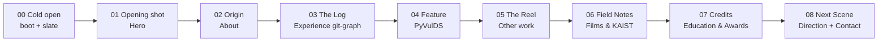

# RUNTIME — Master Plan cho Portfolio mới của Mai Văn Nhật Minh

> Tài liệu gốc (source of truth). Các file `01`–`03` chi tiết hoá từ đây; nếu mâu thuẫn, file này thắng.
> Nội dung hiển thị trên site viết bằng **tiếng Anh** (đối tượng: recruiter quốc tế, hội đồng tuyển sinh, lab nghiên cứu). Tài liệu thiết kế viết tiếng Việt.

Bộ tài liệu:

| File | Nội dung |
|---|---|
| `00-master-plan.md` | Concept, câu chuyện, IA, token contract, quyết định, nội dung cần chuẩn bị |
| `01-design-system.md` | Màu, chữ, lưới, spacing, component, a11y contrast |
| `02a-motion-system-and-act-1.md` | Hệ thống motion (Lenis, tiers, timecode, transitions, cursor) + storyboard scene 00–03 |
| `02b-storyboard-act-2-3.md` | Storyboard scene 04–08, ma trận responsive, checklist reduced-motion & motion QA |
| `03a-tech-architecture.md` | Stack, cấu trúc code, rendering, pipeline video, performance budget, bảo mật, SEO, quality gates |
| `03b-build-roadmap.md` | Lộ trình build P-1…P6, track nội dung của Minh, cut list, risk register, Definition of Done |

---

## 1. Tóm tắt nghiên cứu

### 1.1 Portfolio cũ (`nhat-minh-portfolio.vercel.app`)

- CRA + React 18 + Sanity + Framer Motion + SCSS; template JavaScript Mastery 2022, alias “Charlie”, palette pastel xanh/trắng, emoji 👋.
- Không còn đúng định vị: thiếu HUST Cyber Security, Selfomy, FPT Smart Cloud SRE, PyVulDS, KAIST GPW, mảng quay phim.
- Kỹ thuật: ảnh hero 1.98 MB PNG, tổng tải ~5.2 MB, 5 query Sanity phía client → CLS; 62 lỗi axe (link icon không có tên, contrast 4.25:1, thiếu landmark, nhảy heading h2→h4); tooltip vỡ; link MXH biến mất ở ≤500px.
- **Rủi ro bảo mật cần xử lý ngay, độc lập với redesign:** repo công khai commit `.env` chứa `REACT_APP_SANITY_TOKEN` (token ghi) và token này được bundle vào client → bất kỳ ai cũng ghi/xoá được dataset `production` của project Sanity `6m187e00`. Việc cần làm: revoke token trong Sanity Manage, gỡ `.env` khỏi lịch sử git (hoặc archive repo), tắt form ghi trực tiếp từ client.
- Site cũ còn hiển thị số điện thoại công khai; profile mới quy định **không** công bố số điện thoại.
- Giữ lại: portrait gốc 2561×3840 (xử lý lại màu), các dự án 2020–2022 (Vietcode, VYA, AnimalShelter, HRFO) đưa vào mục “Archive”, các link công khai đã có (GitHub `Supporter09`, Instagram `minhh.dev`, Facebook `minhpmdev`) — vẫn phải xác nhận lại trước khi dùng.

Chi tiết: `research/old-portfolio-audit.md`.

### 1.2 Ba site tham khảo

| Site | Điểm làm nên “stunning” | Ý tưởng lấy | Điều tránh |
|---|---|---|---|
| bryangarage.dev (Next.js, GSAP, Framer, Three.js, cmdk) | Trộn công cụ dev (⌘K, terminal, Geist Mono) với chất người (Instrument Serif, cuộn phim negative có số frame + toạ độ GPS) | Dải **film negative** có frame code + GPS + “tap to develop”; **⌘K command palette** | Cửa sổ nổi chồng nội dung trên mobile; 10 WebGL context |
| curtisdesignr.me (Next.js, Tailwind v4, GSAP+ScrollTrigger+SplitText, Lenis, Three.js) | Header **telemetry** (thành phố, giờ, toạ độ); counter dạng **odometer**; work section pin + cuộn ngang; SplitText | HUD telemetry; odometer cho số liệu **đã kiểm chứng**; pin ngang cho Work (desktop) | Khoá viewport trong container (`#scroll-container`) — phá scroll native/iOS; chặn landscape; neon xanh lá |
| eddy-naboulet.dev (Astro, GSAP Observer, Web Audio, CRT shader) | Nhất quán tuyệt đối với một ẩn dụ (OS cổ); CV dạng **`git log --graph`** với commit theo Conventional Commits | **Git-graph timeline** cho Experience; boot log làm intro; biết dừng ở ẩn dụ — không “cosplay” nửa vời | Pixel font cho nội dung dài; quá nhiều chủ đề màu |

Chi tiết: `research/reference-sites.md`.

> [!warning] Không dùng
> Bản nghiên cứu tham khảo có gợi ý số liệu kiểu “99.99% uptime”, “42+ CVEs analyzed”, “1,200+ commits”. **Không có bằng chứng → không được dùng.** Mọi con số trên site phải nằm trong mục 7 (Claim ledger).

### 1.3 Kết quả ui-ux-pro-max (đã lọc)

- Chấp nhận pattern **Scroll-Triggered Storytelling** (chương, progress indicator, CTA nhỏ cuối chương, DOM đọc được đầy đủ khi tắt motion) + style **Parallax Storytelling** (tiết chế) + **Swiss grid** + một liều nhỏ **analog film** (grain, letterbox, light leak chỉ ở chương du lịch).
- Bác bỏ: font Caveat/Quicksand (handwritten, ngược với tính chỉn chu SRE), Brutalism “no transitions” (ngược mục tiêu mượt), palette xanh lá hacker (profile yêu cầu tránh “generic hacker imagery, neon”).
- Quy tắc GSAP áp dụng: tối đa 2 section pin/trang; SplitText chỉ cho headline < 8 chữ; parallax chỉ cho lớp trang trí, `yPercent` 5–15; `gsap.matchMedia` cho reduced-motion.

Chi tiết: `research/skill-search-notes.md`.

---

## 2. Concept: **RUNTIME**

**Một câu:** Portfolio là một bộ phim ngắn chạy như một hệ thống production — mỗi section là một *scene*, thanh cuộn là *timecode*, và chất lượng được chứng minh bằng *evidence*, không bằng tính từ.

“Runtime” vừa là **thời lượng phim**, vừa là **môi trường chạy của hệ thống**. Một từ gói cả ba mặt của Minh: người kể chuyện bằng máy quay, kỹ sư SRE vận hành hệ thống, và người làm security đòi bằng chứng.

### 2.1 Từ điển ẩn dụ (dùng nhất quán trên toàn site)

| Ngôn ngữ điện ảnh | Ý nghĩa kỹ thuật/nhân vật | Hiện thân trên UI |
|---|---|---|
| **Timecode** `00:03:12:08` | Uptime / tiến độ | Góc HUD hiển thị timecode chạy theo vị trí cuộn; thay cho progress bar |
| **Slate (clapperboard)** | Bắt đầu một đơn vị công việc | Mỗi scene mở bằng slate: `SCENE 04 · TAKE 01 · FEATURE PRESENTATION`, tiêu đề scene (`PyVulDS`) đứng riêng bên dưới |
| **Rack focus** (kéo nét) | Lọc nhiễu → bằng chứng | Case PyVulDS: 38 finding mờ → 2 finding nét (sink filter) |
| **Color grade teal & orange** | Công nghệ (teal) & con người (amber) | Mỗi chương nghiêng về một tông; chương kỹ thuật lạnh, chương du lịch ấm |
| **Letterbox 2.39:1** | Khoảnh khắc “điện ảnh” | Chỉ xuất hiện ở hero và scene pin |
| **Viewfinder brackets** | Scope / phạm vi review | Góc khung thẻ, focus ring, cursor trên media |
| **REC ●** | Live / đang chạy | Chấm trạng thái HUD; trạng thái “in production” |
| **Pre-production / In production / Released** | Trạng thái thật của công việc | Badge trung thực: planned research = *pre-production*, PyVulDS = *in production*, hackathon = *released* |
| **Credits** | Ghi nhận | Giáo dục & giải thưởng trình bày như end credits |

Badge trạng thái là thiết bị **mã hoá ranh giới claim**: không thể vô tình trình bày nghiên cứu dự định như đã xong.

### 2.2 Ba trụ cảm xúc

1. **Cinematic** — nhịp chậm có chủ đích, khung hình rộng, footage thật của Minh, grain nhẹ, chuyển cảnh như cắt dựng.
2. **Precise** — lưới Swiss, mono cho số liệu, tabular numbers, diagram sạch, timing nhất quán; không có animation “cho vui”.
3. **Trustworthy** — mọi số liệu có ngữ cảnh và giới hạn; trạng thái trung thực; a11y và hiệu năng đạt chuẩn (bản thân site là bằng chứng của kỹ năng SRE).

### 2.3 Giọng văn

Precise, modest, technical, evidence-first. Ưu tiên “built / measured / reduced / evaluated”; tránh “passionate / innovative / expert”. Câu ngắn, như phụ đề phim.

---

## 3. Câu chuyện (narrative arc)

Ba hồi, tám scene. Người xem cuộn hết trang = xem hết một “phim” khoảng 3–4 phút đọc.

- **Hồi I — Thiết lập (00–02):** ai đây, nhìn thế giới thế nào. Hook: footage thật + headline định vị.
- **Hồi II — Hành động (03–05):** bằng chứng — production work, nghiên cứu, dự án. Cao trào kỹ thuật là PyVulDS.
- **Hồi III — Con người & hướng đi (06–08):** đằng sau ống kính, KAIST như bước ngoặt định hướng, mục tiêu thạc sĩ Fall 2027, lời mời liên hệ.

Sợi chỉ xuyên suốt: *“I care about what's actually in focus.”* — với máy quay là khoảnh khắc; với hệ thống là độ tin cậy; với security là bằng chứng. (Copy đề xuất, cần Minh duyệt giọng.)

---

## 4. Information Architecture

### 4.1 Routes

| Route | Mục đích | Ghi chú |
|---|---|---|
| `/` | “Phim” chính, 8 scene | Một trang dài, deep-link được qua `#scene-id` |
| `/work/pyvulds` | Case study đầy đủ | Pattern: Problem → Constraints → System Design → Contribution → Evidence → Limitations → Next Step |
| `/work/sre-release-automation` | Case FPT Smart Cloud (chỉ outcome + công nghệ) | Không đưa kiến trúc nội bộ, quy trình, định danh |
| `/work/testeria`, `/work/hust-smart-assistant` | Case ngắn | Cần screenshot |
| `/films` | Toàn bộ reel du lịch | Grid + player; lazy |
| `/archive` | 2020–2022: Vietcode, VYA, AnimalShelter, HRFO | Danh sách gọn, không highlight |
| `/cv` | Bản CV in được (⌘P) | **Chỉ bật khi Minh duyệt bản PDF/nội dung công khai** |
| `/404` | “Scene not found — take 404” | Có link về `/` |
| `/changelog` | Lịch sử build (Conventional Commits) | **Tuỳ chọn, mặc định tắt**; bật sau launch nếu muốn |

### 4.2 Scene contract (trang `/`)

ID dưới đây là **hợp đồng chung** cho cả 3 tài liệu chi tiết và code.

| # | `id` | Nhãn slate | Nội dung chính | Grade | Pin (desktop) |
|---|---|---|---|---|---|
| 00 | `cold-open` | — | Preloader: boot log + slate; session-cached, skip được, ≤ 2.4 s | neutral | overlay |
| 01 | `opening` | SCENE 01 · OPENING SHOT | Footage loop letterbox, tên “Mai Văn Nhật Minh”, headline định vị, 2 CTA | teal→amber | không |
| 02 | `origin` | SCENE 02 · ORIGIN | Short bio; chuyển dịch hackathon/frontend → SWE/DevOps → security research; portrait | amber | không (sticky CSS) |
| 03 | `log` | SCENE 03 · THE LOG | Experience dạng `git log --graph`: Selfomy, FPT Smart Cloud, HUST, hackathons; odometer cho số đã kiểm chứng | teal | không |
| 04 | `pyvulds` | SCENE 04 · FEATURE PRESENTATION | PyVulDS: pipeline 6 bước vẽ dần, rack focus 38→2, precision 0.105→1.000, 0/9→9/9, giới hạn | teal (đậm nhất) | **Pin #1** |
| 05 | `reel` | SCENE 05 · THE REEL | SRE release automation, Testeria, HUST Smart Assistant, AnimalShelter (award), link Archive | mixed | **Pin #2** (cuộn ngang, chỉ ≥1024 px) |
| 06 | `field-notes` | SCENE 06 · BEHIND THE LENS | Phim du lịch & KAIST GPW 2026: dải negative, frame code, GPS, timecode; “tap to develop”; player | amber (đậm nhất), grain + light leak | không |
| 07 | `credits` | SCENE 07 · CREDITS | HUST Cyber Security, 3 học bổng, giải thưởng, IELTS (nếu xác nhận), KAIST GPW | neutral | không |
| 08 | `next-scene` | SCENE 08 · NEXT SCENE | Research direction (*pre-production*), mục tiêu thạc sĩ Fall 2027, Contact CTA; footer tách Engineering / Film links | teal+amber | không |

Persistent chrome:

- **HUD (top):** trái — monogram `NM` (về đầu trang); giữa (≥1024) — `VIETNAM · 21:04 ICT · ● REC` (profile chỉ cho phép công khai cấp quốc gia; đổi sang `HANOI, VN` chỉ khi Minh đồng ý — câu hỏi 6); phải — `⌘K` + `Menu`. Mobile: chỉ monogram + Menu.
- **Timecode (bottom-right, ≥768):** `SC 04 · 00:02:41:12` theo vị trí cuộn; click mở scene list. Là progress indicator theo yêu cầu pattern.
- **Command palette (⌘K / Ctrl K, nút cho touch):** nhảy scene, mở case study, copy email, bật/tắt motion, bật/tắt âm thanh (nếu có).
- **Skip link** “Skip to content” + nút “Skip intro” trong cold open.

### 4.3 CTA theo chương

| Cuối scene | CTA |
|---|---|
| 01 | Primary: “View my engineering and security work” → `#log`; Secondary: “Watch the reel” → `#field-notes` |
| 04 | “Read the PyVulDS case study” → `/work/pyvulds` |
| 05 | “Browse the archive” → `/archive` |
| 06 | “See all films” → `/films` |
| 08 (climax) | “Discuss security systems and research collaboration” → kênh liên hệ đã duyệt |

Mỗi màn hình đúng **một** primary CTA.

---

## 5. Token contract (bắt buộc dùng đúng tên)

Giá trị khởi điểm; `01-design-system.md` được phép tinh chỉnh **giá trị** để đạt contrast nhưng **không đổi tên**.

### 5.1 Màu (dark-first, một theme)

| Token | Giá trị | Vai trò |
|---|---|---|
| `--bg-0` | `#0A0A0B` | Nền trang (không dùng `#000` thuần cho mặt lớn) |
| `--bg-1` | `#111113` | Surface nâng |
| `--bg-2` | `#18181B` | Card / panel |
| `--line` | `#26262B` | Hairline |
| `--line-strong` | `#3A3A40` | Viền nhấn, divider |
| `--ink` | `#F2EEE8` | Chữ chính (trắng ấm như phim) |
| `--ink-2` | `#B9B6B0` | Chữ phụ |
| `--ink-3` | `#9A9893` | Meta, label (đổi từ `#8C8A86` để đạt AA trên surface có grain/tint — bảng contrast ở `01`) |
| `--grade-teal` | `#5BC8C0` | Accent kỹ thuật, link, dữ liệu |
| `--grade-amber` | `#F2A65A` | Accent con người, focus ring, CTA |
| `--rec` | `#FF4D3D` | REC dot, cảnh báo — dùng rất ít |
| `--grain-opacity` | `0.06` | Lớp grain toàn trang (0.10 ở scene 06) |

### 5.2 Chữ

| Token | Font | Dùng cho |
|---|---|---|
| `--font-display` | **Fraunces** (variable: opsz, wght, SOFT, WONK; có subset Vietnamese) | Title card, tên, headline scene — cảm giác title phim |
| `--font-sans` | **Geist** (variable, có Vietnamese) | UI, body |
| `--font-mono` | **Geist Mono** (variable, có Vietnamese) | HUD, timecode, slate, số liệu, code, git log |

Lý do: Instrument Serif (Bryan) **không có subset Vietnamese** → không hiển thị đúng “Mai Văn Nhật Minh”. Fraunces có trục opsz 9–144 cho title lớn tinh tế và italic cho phụ đề. Phương án thay thế body: Be Vietnam Pro.

### 5.3 Motion

| Token | Giá trị | Dùng cho |
|---|---|---|
| `--ease-out` | `cubic-bezier(0.16, 1, 0.3, 1)` | Vào cảnh (expo-out) |
| `--ease-in-out` | `cubic-bezier(0.65, 0, 0.35, 1)` | Chuyển cảnh, wipe |
| `--ease-standard` | `cubic-bezier(0.2, 0, 0, 1)` | Hover, state UI |
| `--dur-instant` | `120ms` | Press, hover màu |
| `--dur-fast` | `200ms` | Tooltip, menu item |
| `--dur-base` | `320ms` | Reveal nhỏ |
| `--dur-slow` | `600ms` | Headline, card |
| `--dur-scene` | `900ms` | Slate, chuyển cảnh |
| Exit | 60–70% thời lượng enter | Toàn site |

Motion tiers:

- **Tier A — full:** `min-width: 1024px` + `pointer: fine` + không reduced-motion. Lenis, 2 pin, custom cursor, SplitText. Guard chiều cao: Pin #1 (`pyvulds`) chỉ khi `min-height: 720px`, Pin #2 (`reel`) chỉ khi `min-height: 600px`; dưới ngưỡng dùng layout không pin.
- **Tier B — touch/tablet:** không pin ngang, không custom cursor, scrub đơn giản, video hero 720p.
- **Tier C — reduced motion:** không Lenis, không scrub/parallax/pin; mỗi scene hiển thị trạng thái cuối; chỉ crossfade ≤ 200 ms; video không autoplay (poster + nút play); preloader bỏ qua.
- **Tier detection không kéo GSAP vào initial bundle:** inline boot script ghi `<html data-tier="A|B|C">` trước paint; `useMotionTier()` đọc thuộc tính đó + native `matchMedia` (không mặc định `'A'`). Scene đang active được phản chiếu ở `<html data-active-scene="<scene-id>">` (dùng cho grain, grade, timecode).
- **Timecode HUD:** ẩn khi `max-height: 500px` (điện thoại ngang); chỉ cập nhật khi có sự kiện scroll (rAF-throttled), không chạy vòng lặp liên tục; chấm REC không nhấp nháy ở Tier C.

### 5.4 Layout

- Breakpoints: `375 / 768 / 1024 / 1440 / 1920`.
- Lưới: 4 cột (mobile) / 8 (tablet) / 12 (desktop); gutter `clamp(16px, 2.5vw, 32px)`; khung tối đa 1440 px + margin “frame”.
- Measure chữ đọc: 60–72 ch.
- Spacing 4pt; section padding-block `clamp(96px, 14vh, 192px)` (density thấp, thoáng).
- z-index: content `10`, HUD `40`, menu `50`, cursor `60`, grain `70` (pointer-events none), modal/palette `100`, cold-open `1000`.

---

## 6. Show-off map: điểm cộng → nơi chứng minh

| Điểm cộng | Bằng chứng | Scene / trang |
|---|---|---|
| Security research có phương pháp | PyVulDS: kiến trúc 6 bước, kết quả có phạm vi, giới hạn rõ | 04, `/work/pyvulds` |
| SRE/DevOps production | Release-ticket automation giảm 70% bước thủ công; ArgoCD notifications; SonarQube tập trung; AI assistant nội bộ | 03, 05, `/work/sre-release-automation` |
| End-to-end ownership | Selfomy: VM→AWS, GitHub Actions, BugSnag, CrowdSec, Laravel + test | 03 |
| Học lực | 3 học bổng Academic Achievement (2024.1, 2024.2, 2025.1); GPA/CPA sau khi xác nhận | 07 |
| Thi đấu & build nhanh | 2nd IAI Hackathon 2023 (Testeria, 50+ học sinh đồng thời), 4th track Samsung SOICT 2023, 3rd Student Creative Ideas 2024, 2nd Future Blue Innovation 2022 | 05, 07 |
| Tầm quốc tế | KAIST SoC GPW 2026 (Daejeon & Seoul), IELTS 7.5 (nếu xác nhận) | 06, 07, 08 |
| Óc thẩm mỹ & kể chuyện | Footage tự quay, color grade, dựng cảnh | 01, 06, `/films` |
| Chỉn chu kỹ thuật | Chính site: Lighthouse ≥ 95 (4 hạng mục, mobile preset), CLS < 0.05, a11y AA, reduced-motion đầy đủ | toàn site; footer build info (commit SHA, build time); `/changelog` tuỳ chọn, mặc định tắt |

---

## 7. Claim ledger (ranh giới nội dung)

| Mục | Trạng thái | Quy tắc hiển thị |
|---|---|---|
| HUST/SOICT Cyber Security, từ 07/2023 | Dùng được | — |
| 3 học bổng Academic Achievement | Dùng được | — |
| Selfomy SWE 07/2024–08/2026 | Dùng được (Minh xác nhận đã kết thúc cuối 08/2026) | Ghi `Jul 2024 – Aug 2026` |
| FPT Smart Cloud DevOps/SRE Intern 06–12/2025 | Dùng được | Chỉ outcome + công nghệ |
| 70% giảm bước thủ công (release workflow) | Dùng được | Odometer được |
| 30% giảm lỗi production (Selfomy) | **Cần bằng chứng/phạm vi** | Nếu chưa có: không odometer, ghi “reported” |
| PyVulDS F1 0.900–0.972 (7 loại), 0/9→9/9, precision 0.105→1.000 (recall 1.000) trên VAmPI SQL, 38→2 trên PyGoat 2 file | Dùng được kèm phạm vi | Luôn kèm câu phạm vi + giới hạn; **không** nói vượt Semgrep |
| HUST Smart Assistant “90% query accuracy” | Mơ hồ | Ghi “reported”, không odometer |
| GPA 3.82 vs 3.84 | **Mơ hồ** | Ẩn đến khi có bảng điểm chính thức |
| IELTS 7.5 | Mơ hồ ngày thi | Ghi “IELTS Academic 7.5” không ngụ ý còn hạn |
| Tốt nghiệp 2027 | Chưa có tháng | Chỉ ghi năm nếu cần |
| Research direction (agentic network security, fuzzing…) | Kế hoạch | Badge **PRE-PRODUCTION** |
| Số điện thoại, email cá nhân, MSSV, bảng điểm | **Không publish** | — |
| Kiến trúc nội bộ FPT, prompt, định danh khách hàng | **Không publish** | — |
| “Expert”, “Researcher” | **Không dùng** | Dùng “Security Research Builder” |

---

## 8. Nội dung & asset Minh cần chuẩn bị

| # | Asset | Spec | Dùng ở |
|---|---|---|---|
| A1 | Hero loop | 8–12 s, cảnh rộng, chuyển động chậm, không mặt người cận (privacy), quay/export 4K→1080p, không âm thanh | 01 |
| A2 | 6–12 clip ngắn | 5–8 s mỗi clip; ghi chú địa điểm, ngày, toạ độ (nếu muốn công khai), máy quay/lens | 06, `/films` |
| A3 | Phim đầy đủ | 2–4 phim (KAIST GPW, chuyến đi cùng bạn); có phụ đề `.vtt` nếu có lời | `/films` |
| A4 | Portrait mới | Ảnh môi trường, ánh sáng có hướng, nền tối; hoặc xử lý lại `profile.png` | 02 |
| A5 | 8–15 still | Frame grab đẹp nhất từ footage | 06, OG image |
| A6 | Diagram PyVulDS | Có thể vẽ lại từ báo cáo; số liệu bảng | 04 |
| A7 | Screenshot | Testeria, HUST Smart Assistant; SRE workflow **đã che** thông tin nội bộ hoặc dùng diagram trừu tượng | 05 |
| A8 | Link công khai | GitHub, LinkedIn, email công việc, kênh video (YouTube/Vimeo/Instagram) | 08, footer |
| A9 | CV PDF công khai | Bản đã lược thông tin riêng tư | `/cv` |
| A10 | Quyền | Đồng ý của bạn bè xuất hiện trong footage; xác nhận được nhắc tên KAIST GPW | 06 |

---

## 9. Quyết định đã chốt

1. **Next.js (App Router) + TypeScript + Tailwind v4 + shadcn/ui** (Dialog, Command, Tooltip) theo skill ui-styling; **GSAP** (ScrollTrigger, SplitText, Flip) + `@gsap/react`; **Lenis** trên window scroll (không containerized).
2. **Không Three.js.** Grain/letterbox/rack-focus bằng CSS/SVG/Canvas 2D; WebGL chỉ cân nhắc nếu đo được ngân sách còn dư (xem `03`).
3. **Dark-only** (một grade). Lý do: cinematic + giảm gấp đôi chi phí kiểm thử contrast. `/cv` có print stylesheet sáng.
4. **Âm thanh mặc định tắt**; nếu làm thì Web Audio synthesized (không tải file), có toggle.
5. **Không** form liên hệ ghi DB ở phase đầu; dùng mailto + LinkedIn — loại bỏ hẳn vector như site cũ.
6. Nội dung lưu dạng **MDX + TypeScript data trong repo**, không CMS (site tĩnh, review bằng PR).
7. **CSP nghiêm ngặt bằng hash** (build 2 pass trích hash cho script inline như preloader), không dùng nonce vì mọi route là SSG; `style-src 'unsafe-inline'` là ngoại lệ có chủ đích (chi tiết `03a`).
8. **Không bundle GSAP/Lenis vào initial JS:** tier đọc từ `<html data-tier>` + native `matchMedia`; GSAP/Lenis import động sau first paint và chỉ ở Tier A/B.

## 10. Câu hỏi mở cho Minh — đã trả lời (2026-10-06)

1. Liên hệ: **LinkedIn** `https://www.linkedin.com/in/charlie1807/` (kênh chính). GitHub `https://github.com/Supporter09` là repo Minh tự đưa → dùng làm link phụ. Không email.
2. Alias: dùng tên thật `Mai Van Nhat Minh` trên site (handle `charlie1807` chỉ xuất hiện trong URL LinkedIn).
3. Domain: chưa chốt — preview chạy local.
4. Toạ độ: **chỉ tên thành phố**, không GPS.
5. Phim: link tạm `#` (placeholder), Minh bổ sung URL sau.
6. HUD: **`VIETNAM`**.
7. Repo: **chỉ local** cho bản preview; Minh tự push sau → footer hiện SHA dạng text, không link.
8. SRE card: **được** gắn badge RELEASED.

Launch blocker cũ (liên hệ, Selfomy) đã gỡ.

## 11. Cập nhật quyết định (2026-10-06)

1. **Site chỉ tiếng Anh.** Tên hiển thị `Mai Van Nhat Minh` (không dấu, đúng public name form trong profile). Font không còn ràng buộc subset Vietnamese → `next/font` chỉ tải `latin`.
2. **Research là một collection, không phải một case đơn lẻ.** PyVulDS là *course research project* tại HUST và là entry đầu tiên + mẫu cho các dự án nghiên cứu sau. Scene `pyvulds` giữ id (anchor ổn định) nhưng dữ liệu đọc từ `content/research.ts` (mảng); scene pin hiển thị entry `featured`, các entry khác hiển thị dạng index bên dưới. Route `/work/[slug]` render mọi entry từ cùng schema.
3. **Hiệu ứng “STILL ROLLING” cho công việc đang tiếp tục:** mọi entry `status: 'in-production'` có (a) chấm REC đỏ nhấp nháy + nhãn `STILL ROLLING`, (b) timecode chạy liên tục (frame đếm 24fps, tính từ ngày bắt đầu → “đã quay được bao lâu”), (c) viền khung có perforation phim chạy chậm quanh card, (d) dòng `TAKE 0n` tăng theo số lần cập nhật (`takes` trong data). Tier C: tất cả đứng yên, giữ nhãn chữ.
4. **Asset tạm:** footage/still là placeholder dựng bằng CSS/SVG (gradient grade + grain + letterbox, nhãn `PLACEHOLDER · A1`), portrait dùng `profile.png` từ repo cũ. Mọi placeholder gom vào `content/media.ts` để thay một chỗ.
5. **Bản preview (local)** gồm toàn bộ giao diện, nội dung, motion, responsive và a11y. Phần hardening production (CSP 2 pass, Lighthouse CI, Playwright suite, pipeline encode video) để sau khi Minh duyệt giao diện.

## 12. Refinement round 1 (feedback của Minh, 2026-10-06)

1. **Font:** bỏ Fraunces (Minh thấy “giống web do Claude sinh”). Display = **Instrument Serif** (400 + italic, dùng tiết chế, headline ngắn); accent = **Geist Pixel** (số, nhãn, badge, keyword highlight); body Geist, data Geist Mono. Token `--font-display` giữ tên, trỏ sang Instrument Serif; thêm `--font-pixel`.
2. **Ít chữ hơn:** copy rút gọn trong `content/*`; keyword nổi bật bằng markup `[[kw]]` / `[[amber:kw]]` / `*italic*` render qua `<Rich>`; tối đa 3 highlight mỗi đoạn.
3. **Scene 03 đổi từ git-log sang Timeline** kiểu bryangarage: thước năm 2022–2027, mỗi engagement một thanh (chip org + vai trò + nơi + thời gian), giải thưởng là pin; bấm/hover mở panel đóng góp (text + media). Dữ liệu ở `content/experience.ts`; `content/log.ts` đã xoá. Id scene vẫn là `log`.
4. **Pixel vibe:** bộ icon bitmap `PixelIcon` (12×12) thay Phosphor cạnh chữ (Phosphor chỉ còn cho logo thương hiệu LinkedIn/GitHub); media **dither** (ma trận chấm Bayer, `components/ui/dither.tsx`) hiện ảnh/video thật khi hover/focus/chạm — áp cho portrait, reel, film strip (nút Develop = reveal), case hero; hero chỉ phủ dither mờ có mask.

## 13. Refinement round 2 (feedback của Minh, 2026-10-06, buổi tối)

1. **Bỏ hẳn serif.** Toàn site dùng Geist (display 500–600, tracking âm) + Geist Pixel (accent) + Geist Mono (data).
2. **Hero = vũ trụ pixel**, không video: sprite Minh ở giữa đổi 6 pose (ngồi, đứng nhìn xa, nghĩ, tò mò, làm việc, nghiên cứu), quanh quỹ đạo: mèo Gạo, hành tinh YouTube (avatar kênh thật), MacBook Air M4, Osmo Pocket 4, sao nhấp nháy; parallax theo chuột; nút Pause orbit. Sprite là dữ liệu trong `content/sprites.ts` (Minh có thể thay bằng art của mình).
3. **Story flow giữa các scene** (scrub, đảo chiều được, Tier C tĩnh): hero → origin: sprite "số hoá" thành dòng pixel chảy xuống khung portrait, portrait nhận dữ liệu rồi hiện; origin → timeline: đường năng lượng teal cắm vào góc trái thước năm, bar/pin hiện dần; research: gõ chữ "Research" → xoá → gõ "Every system has a hole." / "I'd rather be the one who finds it."
4. **Thứ tự scene mới** 00–09: Boot · Hi, I'm Minh. · The person in the frame · The story so far · Research · What I'm chasing next (card có pixel art, không badge) · Things I've shipped · When I'm not at a terminal · Achievements · Roll credits? Not yet. (scene `closing` mới chứa CTA + END OF RUNTIME). **Bỏ khối "research aim"** (mục tiêu thạc sĩ Fall 2027) theo yêu cầu.
5. Highlight pixel có hiệu ứng neon sáng mượt khi hover; bỏ mọi nhãn PLACEHOLDER; header dùng avatar YouTube thay monogram.
6. **Đẩy sớm scrub timeline (Section 2 → 3):** đường năng lượng bắt đầu vẽ ngay khi rời portrait, hoàn thành toàn bộ timeline (tất cả các thanh, thước năm, pins) ngay khi tiêu đề Section 3 ("The story so far") chạm mép trên màn hình dưới HUD.
7. **Hero gọn gàng:** bỏ dòng tên đầy đủ thừa thãi "Mai Van Nhat Minh" bên trên "Hi, I'm Minh.".
8. **Tiêu đề Section 2 dí dỏm:** đổi thành *"A bit about me (the uncompiled cut)"* — vừa mang vibe code ("uncompiled"), vừa giữ ẩn dụ điện ảnh ("cut").
9. **Logo avatar trong suốt:** tách nền trắng của avatar kênh YouTube thành file PNG trong suốt, hiển thị liền mạch trên thanh HUD và hành tinh YouTube.
10. **Section 2 — Tinh chỉnh tiêu đề và quote:**
    - Tiêu đề rút gọn: *"A bit about me"*.
    - Câu trích dẫn dí dỏm: *"Breaking systems to make them resilient, explaining bug reports to my cat, and filming the good parts."*.
11. **Dây năng lượng timeline:** Nắn lại đường cong mềm mại cắm trực tiếp vào nhãn `EDUCATION` ở cột bên trái của timeline.
12. **Cập nhật dữ liệu thực tế:**
    - KAIST GPW: 1 tuần (06–13/09/2026), trạng thái `released`.
    - PyVulDS: Hoàn thành trong 3 tháng (03–06/2026), trạng thái `released` (bỏ badge STILL ROLLING và đồng hồ REC nhấp nháy, timeline không còn kéo dài tới NOW).
13. **PyVulDS — Trực quan từ đầu:** Ô kết quả Scope (38 → 2) và nút "Read the case study" luôn hiển thị nội dung ngay từ đầu, animation rack-focus chạy mượt mà khi cuộn tới.
14. **Carousel Things I've shipped (Reel):** Khắc phục triệt để hiện tượng vỡ/tràn canvas dither ra ngoài viền card số 3 khi cuộn ngang.
15. **Carousel Field Notes:**
    - Sửa lỗi nút Back bị liệt khi đã cuộn tới ảnh cuối cùng (05A).
    - Hỗ trợ cuộn chuột ngang (mousewheel horizontal scroll) khi rê chuột vào dải phim, ra ngoài cuộn dọc bình thường (giống bryangarage).
