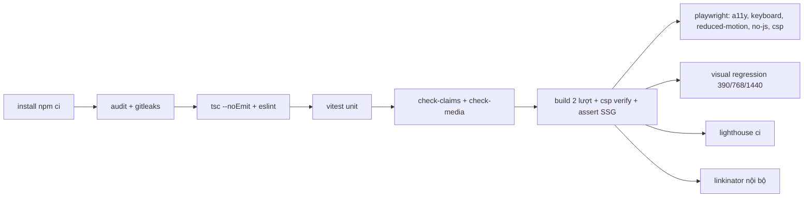

# 03a — Kiến trúc kỹ thuật RUNTIME

> Chi tiết hoá từ `00-master-plan.md` (§4 IA, §5 token, §7 claim ledger, §8 asset, §9 quyết định). Khi mâu thuẫn, master thắng; điểm lệch được ghi ở cuối file trong mục **Ghi chú cho orchestrator**.
> Phạm vi: stack, cấu trúc code, mô hình nội dung, rendering, pipeline media, performance budget, bảo mật & quyền riêng tư, SEO, quality gate. Lộ trình build nằm ở `03b-build-roadmap.md`.
> Phiên bản trong file này lấy bằng `npm view <pkg> version` ngày **2026-10-06**, kèm link nguồn. Khi bắt đầu P0, chạy lại lệnh đó rồi ghim phiên bản chính xác trong `package-lock.json`.

---

## 0. Tóm tắt quyết định

| # | Quyết định | Lý do ngắn |
|---|---|---|
| D1 | Next.js 16 App Router, **mọi route đều SSG**, RSC mặc định | Site tĩnh, không có dữ liệu runtime; HTML đầy đủ ngay khi tắt JS |
| D2 | GSAP + Lenis **tải động sau first paint**, theo tier | Giữ initial JS ≤ 180 KB gz, LCP không phụ thuộc thư viện motion |
| D3 | Cold open chạy bằng **CSS keyframes**; inline boot script chỉ đặt `data-tier` / `data-boot` | Overlay không bao giờ chặn nội dung; vẫn chạy được khi chunk JS lỗi |
| D4 | Nội dung = MDX + TypeScript data, validate bằng zod, **guard `claimStatus` lúc build** | Ranh giới claim (§7) được kiểm tra bằng máy, không chỉ bằng review |
| D5 | Video ngắn tự host (AV1 WebM + H.264 MP4), phim dài dùng **YouTube nocookie + facade** | Kiểm soát byte của hero; không có iframe bên thứ ba trước khi người xem bấm |
| D6 | CSP chặt bằng **hash per-route**, sinh lúc build theo 2 lượt (không dùng nonce) | Nonce bắt buộc dynamic rendering → mất SSG (xem §7.1) |
| D7 | Không DB, không form, không token phía client; analytics không cookie (Vercel) | Loại bỏ hẳn lớp lỗi đã xảy ra ở site cũ |

---

## 1. Stack & phiên bản

### 1.1 Phụ thuộc runtime

| Gói | Phiên bản (2026-10-06) | Vai trò | Vì sao chọn | Nguồn |
|---|---|---|---|---|
| `next` | **16.3.x** (npm `latest` = 16.3.8) | Framework, router, `next/font`, `next/image`, `next/og`, Metadata API | App Router + RSC cho phép SSG mặc định và client island nhỏ. Từ v16, Turbopack là bundler mặc định và `middleware` được đổi tên thành `proxy`. **Bắt buộc** dùng bản vá mới nhất của nhánh 16.3, vì năm 2026 đã có nhiều đợt security release (tháng 7, tháng 8 và bản vá critical ngày 22/09) | [npm](https://www.npmjs.com/package/next) · [Next 16](https://nextjs.org/blog/next-16) · [Blog/security](https://nextjs.org/blog) · [July 2026 security release](https://nextjs.org/blog/july-2026-security-release) |
| `react`, `react-dom` | **19.x** (npm `latest` = 19.3.0; react.dev ghi dòng 19.2) | UI runtime | Bắt buộc theo Next 16; dùng đúng bản peer mà Next yêu cầu | [npm](https://www.npmjs.com/package/react) · [react.dev/versions](https://react.dev/versions) |
| `tailwindcss` + `@tailwindcss/postcss` | **4.3.x** (4.3.3) | Styling | Cấu hình CSS-first `@theme`, ánh xạ thẳng token §5 thành CSS variables; không cần file config JS | [v4.0](https://tailwindcss.com/blog/tailwindcss-v4) · [v4.3](https://tailwindcss.com/blog/tailwindcss-v4-3) |
| `gsap` | **3.15.x** (3.15.0) | Timeline, ScrollTrigger, SplitText, Flip | Chuẩn ngành cho scroll choreography; `gsap.matchMedia` hợp với mô hình tier; plugin đã miễn phí (xem 1.2) | [npm](https://www.npmjs.com/package/gsap) · [Pricing](https://gsap.com/pricing) |
| `@gsap/react` | **2.1.x** (2.1.2) | Hook `useGSAP` (cleanup theo scope) | Tự `revert()` khi unmount, an toàn với React 19 Strict Mode | [npm](https://www.npmjs.com/package/@gsap/react) |
| `lenis` | **1.3.x** (1.3.26) | Smooth scroll trên **window** | Nhẹ, không bọc container, giữ `position: sticky` và scroll native của iOS (`syncTouch: false`) | [npm](https://www.npmjs.com/package/lenis) · [GitHub](https://github.com/darkroomengineering/lenis) |
| `shadcn` (CLI, chỉ dev) | **4.x** (4.21.2) | Sinh `Dialog`, `Command`, `Tooltip` vào `components/ui` | Code nằm trong repo, sửa được; hỗ trợ Tailwind v4 + React 19 | [CLI](https://ui.shadcn.com/docs/cli) · [Tailwind v4](https://ui.shadcn.com/docs/tailwind-v4) |
| `cmdk` | 1.1.x (1.1.1) | Lõi của shadcn `Command` (palette ⌘K) | Do shadcn kéo vào; có điều hướng bàn phím và ARIA combobox | [npm](https://www.npmjs.com/package/cmdk) |
| `@next/mdx` + `@mdx-js/loader` + `@mdx-js/react` + `@types/mdx` | `@next/mdx` 16.3.x; MDX 3.x (`@mdx-js/mdx` 3.1.1) | Case study MDX | Biên dịch lúc build, chạy được trong RSC, không tốn runtime. Với Turbopack, plugin remark/rehype phải truyền **dạng string**, option phải serializable | [Next MDX guide](https://nextjs.org/docs/app/guides/mdx) |
| `@phosphor-icons/react` | **2.1.x** (2.1.10) | Icon | Nét mảnh, có trọng số `thin/light`, hợp tông "precise". Trong RSC import từ `@phosphor-icons/react/ssr` | [npm](https://www.npmjs.com/package/@phosphor-icons/react) · [Releases](https://github.com/phosphor-icons/react/releases) |
| `zod` | 4.x (4.6.5) | Validate content lúc build | Chỉ chạy phía server/build, không vào client bundle | [npm](https://www.npmjs.com/package/zod) |
| `@vercel/analytics`, `@vercel/speed-insights` | 2.0.x | Analytics không cookie + RUM Web Vitals | Script phục vụ cùng origin (`/_vercel/...`), nên CSP chỉ cần `'self'` | [Privacy](https://vercel.com/docs/analytics/privacy-policy) · [Docs](https://vercel.com/docs/analytics) |

Font: Fraunces, Geist, Geist Mono qua `next/font/google` với `subsets: ['latin', 'vietnamese']`. `next/font` tự host font, nên CSP dùng `font-src 'self'`.

Runtime build: **Node 24 LTS** trên Vercel (Next 16 yêu cầu Node ≥ 20.9). Package manager: **npm** (`npm ci`, lockfile v3), để `npm audit` dùng được trực tiếp.

### 1.2 Giấy phép GSAP sau khi Webflow mua lại

- Webflow mua GreenSock vào mùa thu 2024. Từ 30/04–01/05/2025, **toàn bộ GSAP miễn phí cho mọi người, kể cả dùng thương mại**. Điều này gồm cả các plugin trước đây chỉ dành cho Club GSAP: **SplitText** (được viết lại, có tuỳ chọn `aria`), **Flip**, MorphSVG, ScrollSmoother… **ScrollTrigger** vốn đã miễn phí. Tất cả nằm trong gói `gsap` trên npm công khai, không cần registry riêng hay token. Nguồn: [Webflow blog](https://webflow.com/blog/gsap-becomes-free), [Webflow updates](https://webflow.com/updates/gsap-becomes-free), [gsap.com/pricing](https://gsap.com/pricing).
- Giấy phép là **Standard "No Charge" License**: độc quyền, **không phải OSI open-source**. Điều khoản giới hạn chính là không dùng GSAP để làm công cụ dựng animation trực quan cạnh tranh với Webflow. Portfolio không rơi vào trường hợp này. Nguồn: [Standard License](https://gsap.com/community/standard-license/).
- Hệ quả cho repo: liệt kê GSAP trong `THIRD_PARTY_NOTICES` hoặc README với nhãn "proprietary, no-charge". Không copy mã nguồn plugin vào repo; chỉ import từ `gsap/*`.

### 1.3 Phụ thuộc dev / quality

`@playwright/test` 1.63 · `@axe-core/playwright` 4.13 · `@lhci/cli` 0.15 · `@next/bundle-analyzer` 16.3 · `vitest` 5.0 · `linkinator` 8.1 · `typescript` 5.x · `eslint` (gọi CLI trực tiếp, vì `next lint` đã deprecated từ 15.5 — [Next 15.5](https://nextjs.org/blog/next-15-5)). Công cụ ngoài npm: `ffmpeg` ≥ 6 (có libsvtav1, libaom, libwebp), `exiftool`, `gitleaks`.

### 1.4 Phương án bị loại

| Phương án | Lý do loại |
|---|---|
| **Three.js / R3F** | Master §9.2 không dùng. Cộng thêm ~150 KB+ gz và một WebGL context, trong khi grain, letterbox và rack focus làm được bằng CSS/SVG/Canvas 2D. Bryan Garage có 10 WebGL context, đúng anti-pattern cần tránh |
| **Framer Motion / Motion** | Mạnh ở animation theo trạng thái component, yếu ở scroll choreography nhiều scene có pin và scrub. Dùng song song với GSAP thì phải gánh hai engine, hai mô hình timing. Site cũ cũng dùng Framer với `whileInView` lặp lại, đúng thứ cần bỏ |
| **Sanity / headless CMS** | Master §9.6 không dùng CMS. Site cũ fetch client-side gây CLS và **lộ token ghi**. Nội dung ít, thay đổi chậm, review qua PR tốt hơn |
| **Astro** | Islands rất tốt cho site tĩnh, nhưng master đã chốt Next + shadcn. Chuyển cảnh Flip giữa `/` và `/work/*` cùng palette dùng chung state dễ làm hơn với router của Next. Ghi nhận Astro là phương án B nếu mai này bỏ React |
| **Containerized scroller** (Locomotive kiểu cũ, ScrollSmoother wrapper, `#scroll-container`) | Khoá viewport trong container làm hỏng scroll native/iOS, `position: sticky`, find-in-page, anchor `#scene-id` và trình đọc màn hình (anti-pattern của curtisdesignr). Lenis chạy trên window giữ được tất cả những thứ này |
| `next-mdx-remote` / Contentlayer / Velite | Nội dung nằm sẵn trong repo, `@next/mdx` là đủ. Contentlayer không còn được bảo trì; Velite thêm một lớp build nữa mà không đem lại gì thêm |
| `lucide-react` (icon mặc định của shadcn) | Tránh dùng hai bộ icon. Khi `shadcn add`, thay import lucide trong `dialog.tsx` và `command.tsx` bằng Phosphor, và không cài `lucide-react` |
| Vercel Blob / CDN ngoài cho clip ngắn | Thêm origin vào CSP, thêm chi phí. Clip ngắn để trong `public/media` là đủ (xem §5) |

---

## 2. Cấu trúc dự án

```text
runtime/
├── app/
│   ├── layout.tsx                  # RSC: <html lang="en">, fonts, <BootScript/>, chrome, <Analytics/>, footer build info
│   ├── globals.css                 # @import "tailwindcss"; @theme ánh xạ token §5; CSS cold-open; trạng thái theo [data-tier]
│   ├── page.tsx                    # "/"  — 9 <SceneShell> theo §4.2, render từ content/scenes.ts
│   ├── not-found.tsx               # /404 — "Scene not found — take 404", link về "/"
│   ├── opengraph-image.tsx         # OG mặc định (next/og)
│   ├── icon.svg · apple-icon.png
│   ├── sitemap.ts · robots.ts
│   ├── work/
│   │   └── [slug]/
│   │       ├── page.tsx            # generateStaticParams → pyvulds | sre-release-automation | testeria | hust-smart-assistant
│   │       │                       # dynamicParams = false  → slug lạ ra 404
│   │       └── opengraph-image.tsx # OG theo case (slate "SCENE 04 · PYVULDS"…)
│   ├── films/
│   │   ├── page.tsx                # /films — grid + <FilmFrame> facade
│   │   └── opengraph-image.tsx
│   ├── archive/page.tsx            # /archive — Vietcode, VYA, AnimalShelter, HRFO
│   └── cv/
│       ├── page.tsx                # /cv — bị gate: site.cvPublished=false → notFound() lúc build, không vào sitemap
│       └── print.css               # print stylesheet sáng (ngoại lệ duy nhất của dark-only)
├── components/
│   ├── scenes/
│   │   ├── scene-shell.tsx         # <SceneShell id grade pin> — <section id aria-labelledby data-scene data-grade>
│   │   ├── slate.tsx               # <Slate scene take label/>
│   │   ├── cold-open/              # cold-open.tsx (RSC markup + CSS), cold-open-controller.tsx ('use client': Skip, Esc, sessionStorage)
│   │   ├── opening/                # opening-scene.tsx, hero-video.tsx ('use client'), opening.motion.ts
│   │   ├── origin/                 # origin-scene.tsx, origin.motion.ts
│   │   ├── log/                    # log-scene.tsx, git-graph.tsx (SVG RSC), log.motion.ts
│   │   ├── pyvulds/                # pyvulds-scene.tsx, pipeline-diagram.tsx, rack-focus.tsx, pyvulds.motion.ts  (Pin #1)
│   │   ├── reel/                   # reel-scene.tsx, reel-controls.tsx ('use client'), reel.motion.ts            (Pin #2)
│   │   ├── field-notes/            # field-notes-scene.tsx, film-strip.tsx ('use client'), lightbox.tsx ('use client'), field-notes.motion.ts
│   │   ├── credits/                # credits-scene.tsx, credits.motion.ts
│   │   └── next-scene/             # next-scene-scene.tsx, next-scene.motion.ts
│   ├── chrome/
│   │   ├── hud.tsx                 # RSC khung; con: hud-clock.tsx ('use client', giờ ICT); đăng ký listener eager cho window event `open-scene-palette` → lazy-import command-palette, mở lọc group 'Scenes'
│   │   ├── scene-observer.tsx      # ('use client') IntersectionObserver → đặt `html[data-active-scene]` (grain 0.10 chỉ ở "field-notes", grade, timecode)
│   │   ├── timecode-hud.tsx        # <TimecodeHUD> ('use client') — đọc window.scrollY, không import Lenis; cập nhật theo scroll (rAF-throttled), ẩn khi max-height: 500px
│   │   ├── command-palette.tsx     # <CommandPalette> ('use client', lazy khi bấm ⌘K / nút); export `openCommandPalette({ group?: 'Scenes' | 'Work' | 'Actions' })`
│   │   ├── menu.tsx                # Dialog full-screen
│   │   ├── cursor.tsx              # chỉ Tier A, lazy
│   │   ├── grain.tsx               # RSC: SVG feTurbulence/PNG tile + CSS, pointer-events none, z 70
│   │   ├── skip-link.tsx
│   │   └── site-footer.tsx         # link Engineering / Film + build info (SHA, thời điểm build)
│   ├── media/
│   │   ├── video-loop.tsx          # ('use client') IntersectionObserver play/pause, nút Pause, chọn 720/1080 theo tier
│   │   ├── film-frame.tsx          # <FilmFrame> — poster local + facade YouTube nocookie
│   │   └── poster-picture.tsx      # <picture> AVIF/WebP cho poster video (LCP)
│   ├── evidence/
│   │   ├── metric.tsx              # <Metric claim="…"/> — render số + câu phạm vi + qualifier "reported"
│   │   ├── odometer-metric.tsx     # <OdometerMetric> — chỉ nhận VerifiedMetric (ràng buộc ở type)
│   │   └── status-badge.tsx        # <StatusBadge status="pre-production|in-production|released">
│   ├── mdx/                        # case-study-layout.tsx, figure.tsx, limitations.tsx, evidence-table.tsx
│   └── ui/                         # shadcn: dialog.tsx, command.tsx, tooltip.tsx (+ utils cn)
├── lib/
│   ├── motion/
│   │   ├── tiers.ts                # MotionTier, MOTION_CONDITIONS, useMotionTier() (native matchMedia, khởi tạo từ <html data-tier>)
│   │   ├── motion-provider.tsx     # ('use client') đợi first paint + idle → import('./runtime') nếu tier ≠ C
│   │   ├── runtime.ts              # chunk lazy: gsap + ScrollTrigger + SplitText + Flip (+ Lenis nếu tier A), registerPlugin, gsap.matchMedia
│   │   ├── lenis.ts                # initSmoothScroll() / getLenis() — theo 02a §2.2, chỉ import từ runtime.ts
│   │   ├── timecode.ts             # hàm thuần `formatTimecode`: progress → "SC 04 · 00:02:41:12" (24 fps, 240 s danh nghĩa); frame = Math.min(Math.floor(progress*TOTAL_FRAMES), TOTAL_FRAMES) ⇒ cuối trang = `00:04:00:00` (khớp test)
│   │   ├── split.ts                # SplitText helper: đợi document.fonts.ready, aria, revert
│   │   └── scroll-restore.ts       # lưu/khôi phục scrollY khi đi / ⇄ /work/*
│   ├── boot/boot-script.ts         # export const BOOT_SCRIPT: chuỗi inline script (hằng số), dùng chung cho layout và scripts/csp-hashes.mjs
│   ├── content/
│   │   ├── schema.ts               # zod schema + type (ClaimStatus, Claim, Metric, Experience, Award, Film, Link, CaseMeta)
│   │   ├── guard.ts                # publishable(), assertPublishable(), IS_PRODUCTION
│   │   └── load.ts                 # đọc + validate data/MDX meta, chỉ dùng phía server
│   ├── security/csp.ts             # dựng chuỗi CSP từ directive + hash per-route
│   ├── seo/                        # metadata.ts (template title), json-ld.ts (Person), og-template.tsx
│   └── site/build-info.ts          # SHA, thời điểm build (từ env lúc build)
├── content/
│   ├── site.ts                     # cvPublished, siteUrl, các cờ tính năng
│   ├── scenes.ts                   # 9 scene id theo §4.2 (nguồn duy nhất cho page, palette, timecode)
│   ├── claims.ts                   # sổ claim (§7) — mọi con số trên site tham chiếu id ở đây
│   ├── experience.ts · awards.ts · films.ts · links.ts · archive.ts
│   └── work/                       # pyvulds.mdx · sre-release-automation.mdx · testeria.mdx · hust-smart-assistant.mdx
├── mdx-components.tsx              # bắt buộc với @next/mdx App Router
├── assets/
│   ├── images/                     # nguồn raster cho next/image (portrait.jpg, stills/*.jpg, work/*.png) — static import
│   └── og-fonts/                   # Fraunces & Geist Mono TTF subset (latin + vietnamese) cho next/og
├── public/media/                   # video + poster đã encode (xem §5.6)
├── scripts/
│   ├── encode-video.sh · encode-poster.sh   # công thức ffmpeg §5
│   ├── check-media.mjs             # kiểm kích thước, codec, GPS EXIF
│   ├── check-claims.ts             # prebuild: validate content + guard claimStatus
│   └── csp-hashes.mjs              # trích inline script → hash per-route; --verify
├── tests/
│   ├── unit/                       # vitest: guard, timecode, schema, mdx-number-lint
│   └── e2e/                        # playwright: a11y, keyboard, reduced-motion, no-js, csp, visual
├── .github/workflows/ci.yml · renovate.json
└── next.config.ts · lighthouserc.cjs · playwright.config.ts · vitest.config.ts · components.json · tsconfig.json
```

Đối chiếu route §4.1: `/` → `app/page.tsx`; `/work/pyvulds`, `/work/sre-release-automation`, `/work/testeria`, `/work/hust-smart-assistant` → `app/work/[slug]` (bốn slug cố định trong `generateStaticParams`, `dynamicParams = false`); `/films` → `app/films`; `/archive` → `app/archive`; `/cv` → `app/cv` (bị gate); `/404` → `app/not-found.tsx`.

Quy ước: file kebab-case. Component chỉ thêm `'use client'` khi có state, effect hoặc event. Mỗi `*.motion.ts` export `default (ctx: SceneMotionContext) => () => void` (hàm trả về cleanup), và **chỉ** được import động từ `lib/motion/runtime.ts`.

### 2.1 Token trong Tailwind v4

`globals.css` khai báo token §5 nguyên tên trong `:root` rồi ánh xạ sang namespace của Tailwind bằng `@theme inline`, ví dụ `--color-bg-0: var(--bg-0)`, `--color-ink: var(--ink)`, `--color-grade-teal: var(--grade-teal)`. `--font-display/sans/mono` và `--ease-out/--ease-in-out` **trùng namespace** của Tailwind nên sinh utility trực tiếp (`font-display`, `ease-out`). Lưu ý: việc trùng tên này **ghi đè** giá trị `ease-out` / `ease-in-out` mặc định của Tailwind, và đó là chủ đích. z-index lấy theo §5.4.

---

## 3. Mô hình nội dung & guard `claimStatus`

### 3.1 Schema (`lib/content/schema.ts`)

```ts
import { z } from 'zod';

export const ClaimStatus = z.enum(['verified', 'reported', 'confirm-before-publish', 'planned']);
export type ClaimStatus = z.infer<typeof ClaimStatus>;

export const ProductionStatus = z.enum(['pre-production', 'in-production', 'released']);

const Base = z.object({
  id: z.string().regex(/^[a-z0-9-]+$/),
  claimStatus: ClaimStatus,
  /** 'hide' (mặc định): ẩn khỏi production; 'fail': làm build production thất bại. */
  onUnconfirmed: z.enum(['hide', 'fail']).default('hide'),
  source: z.string(), // tham chiếu nội bộ (CV 2026, PyVulDS report…) — KHÔNG render
});

export const Claim = Base.extend({
  statement: z.string(),            // câu EN hiển thị
  scope: z.string().optional(),     // câu phạm vi/giới hạn — bắt buộc khi có số benchmark
});

export const Metric = Claim.extend({
  value: z.number(),
  from: z.number().optional(),      // 38 → 2, 0.105 → 1.000
  unit: z.enum(['%', 'cases', 'findings', 'score']).optional(),
  display: z.enum(['odometer', 'static']),
}).refine((m) => m.display !== 'odometer' || m.claimStatus === 'verified',
  { message: 'Chỉ claim verified mới được dùng odometer (§7)' });

export const Experience = Base.extend({
  org: z.string(), role: z.string(),
  start: z.string().regex(/^\d{4}-\d{2}$/),
  commits: z.array(LogCommit),                     // dữ liệu cho git-graph scene 03
});

export const LogCommit = z.object({
  lane: z.enum(['main', 'work', 'ship', 'research', 'field']),
  type: z.enum(['feat', 'perf', 'sec', 'award', 'research']),
  scope: z.string(), message: z.string(),
  date: z.string().regex(/^\d{4}-\d{2}(-\d{2})?$/),
  claimId: z.string().optional(),                  // liên kết sổ claim §3.2
});

export const Work = Base.extend({
  slug: z.enum(['pyvulds', 'sre-release-automation', 'testeria', 'hust-smart-assistant']),
  status: ProductionStatus,
}).refine((w) => w.claimStatus !== 'planned' || w.status === 'pre-production',
  { message: 'Claim planned phải mang badge PRE-PRODUCTION' });

export const Film = Base.extend({
  title: z.string(), place: z.string(), date: z.string(),
  gps: z.object({ lat: z.number(), lon: z.number(), publish: z.boolean() }).optional(), // opt-in §10.4
  youtubeId: z.string().optional(), captions: z.string().optional(),            // .vtt
  consent: z.boolean(),                                                         // A10 — false ⇒ không publish
});
// Award, Link (sameAs JSON-LD chỉ lấy claimStatus 'verified'), ArchiveItem, CaseMeta (export const meta trong MDX) cùng mẫu.
```

Mỗi case MDX khai `export const meta = {...} satisfies CaseMeta` (không dùng YAML frontmatter, vì `@next/mdx` không parse frontmatter). Số liệu trong MDX **phải** viết qua `<Metric claim="pyvulds-vampi-precision" />`, không gõ tay.

### 3.2 Sổ claim khởi điểm (`content/claims.ts`, ánh xạ §7)

| id | claimStatus | onUnconfirmed | display |
|---|---|---|---|
| `hust-cybersec` | verified | — | static |
| `scholarships-3` | verified | — | odometer (3) |
| `fpt-release-70pct` | verified | — | odometer |
| `pyvulds-f1-range`, `pyvulds-path-9of9`, `pyvulds-vampi-precision`, `pyvulds-pygoat-38to2` | verified (luôn kèm `scope`) | — | static (odometer chỉ cho 70 % và 3) |
| `selfomy-end-present` | confirm-before-publish | **fail** | — |
| `selfomy-errors-30pct` | reported | — | static + qualifier "reported" |
| `hust-sa-accuracy-90` | reported | — | static + "reported" |
| `gpa` | confirm-before-publish | hide | — |
| `ielts-7-5` | verified | — | static: "IELTS Academic 7.5" (không ngày thi, không ngụ ý còn hạn) |
| `contact-primary` | confirm-before-publish | **fail** | — |
| `research-direction` | planned | — | badge PRE-PRODUCTION |

Phone, email cá nhân, MSSV, bảng điểm, kiến trúc nội bộ FPT **không có schema** nên không thể vô tình render.

`contact-primary` là launch blocker (master Q1): CTA Scene 08, lệnh palette "Copy email" và footer đều đọc kênh liên hệ qua `assertPublishable(claims['contact-primary'])`, nên build production fail cho tới khi Minh duyệt kênh.

### 3.3 Guard (`lib/content/guard.ts`)

```ts
export const IS_PRODUCTION = process.env.VERCEL_ENV === 'production';

export class UnconfirmedClaimError extends Error {}

type Guarded = { id: string; claimStatus: ClaimStatus; onUnconfirmed?: 'hide' | 'fail' };

export function publishable<T extends Guarded>(items: readonly T[]): T[] {
  return items.filter((item) => {
    if (item.claimStatus !== 'confirm-before-publish') return true;
    if (!IS_PRODUCTION) return true; // preview: hiện kèm watermark "UNCONFIRMED"
    if (item.onUnconfirmed === 'fail') throw new UnconfirmedClaimError(item.id);
    return false;
  });
}

/** Gọi trong <Metric>/<Claim> khi render; SSG ⇒ throw = `next build` fail. */
export function assertPublishable(item: Guarded): void {
  if (IS_PRODUCTION && item.claimStatus === 'confirm-before-publish')
    throw new UnconfirmedClaimError(`Claim "${item.id}" chưa được xác nhận nhưng đang được render`);
}
```

Ba lớp bảo vệ:

1. `scripts/check-claims.ts` chạy ở `prebuild`. Nó validate zod toàn bộ `content/*.ts` + `meta` của MDX, và ở production thì fail nếu còn claim `onUnconfirmed: 'fail'`.
2. Runtime-at-build: mọi component hiển thị claim đều gọi `assertPublishable`. MDX lỡ tham chiếu claim chưa xác nhận → build production fail.
3. Test (§9): DOM production không chứa `[data-claim-status="confirm-before-publish"]`. Lint MDX: regex `\d+(\.\d+)?\s?%` nằm ngoài `<Metric>` → fail.

Preview deployment (`VERCEL_ENV=preview`) render cả claim chưa xác nhận, có viền `--rec` và nhãn `UNCONFIRMED`, để Minh duyệt trực tiếp trên URL preview.

---

## 4. Rendering

### 4.1 Nguyên tắc

- **SSG cho mọi route.** Không dùng `cookies()`, `headers()` hay `connection()`; không bật Cache Components. CI kiểm tra `.next/prerender-manifest.json` phải chứa đủ 8 đường dẫn (`/`, 4 `/work/*`, `/films`, `/archive`, `/_not-found`; `/cv` khi được bật). Thiếu hoặc thừa route dynamic → fail.
- **RSC mặc định.** Toàn bộ copy, diagram SVG, git-graph, bảng evidence, credits đều render trên server ở **trạng thái cuối**. Đây cũng là bản Tier C.
- **Client island** chỉ cho: `cold-open-controller`, `motion-provider`, `hud-clock`, `timecode-hud`, `command-palette` (lazy), `menu`, `cursor` (lazy, chỉ A), `video-loop`, `film-strip`, `lightbox`, `reel-controls`, `odometer-metric`, `film-frame`.
- **Không-JS** (kiểm bằng e2e `javaScriptEnabled: false`): mọi scene hiển thị đầy đủ; anchor `#scene-id` hoạt động; palette thay bằng link `Menu` thường (`<a href="#scene-list">`); video hiện poster kèm link tải/xem; overlay cold open **không** hiển thị.

### 4.2 Trình tự tải

```mermaid
sequenceDiagram
  participant B as Browser
  participant H as HTML (SSG)
  participant M as motion-provider
  participant R as runtime chunk (gsap+lenis)
  B->>H: GET / (CDN cache)
  H-->>B: <head> inline boot script → html[data-tier][data-js][data-boot?]
  B->>B: First paint: nội dung cuối + overlay cold-open (CSS, nếu data-boot=play)
  B->>B: LCP = poster hero (preload, fetchpriority=high)
  M->>M: useEffect → requestIdleCallback (timeout 1200 ms)
  alt tier A hoặc B
    M->>R: import('@/lib/motion/runtime')
    R-->>M: registerPlugin, (Lenis nếu A), pin scenes theo thứ tự tài liệu
    M->>B: html[data-motion=ready]; scene khác init lười bằng IntersectionObserver
  else tier C
    M->>B: html[data-motion=off] — không tải runtime
  end
  B->>B: sau window.load + idle: gắn <source> cho hero video, play khi trong viewport
```

- `motion-provider` dùng `requestIdleCallback` (fallback `setTimeout(…, 1)` sau `requestAnimationFrame` đôi). Runtime chunk **không bao giờ** nằm trong initial JS; kiểm bằng bundle analyzer và LHCI `resource-summary`.
- Hai scene có pin (`pyvulds`, `reel`) khởi tạo ngay khi runtime sẵn sàng, **theo thứ tự trong tài liệu**, để pin-spacing đúng. Guard chiều cao (master): Pin #1 `pyvulds` chỉ khi `min-height: 720px`, Pin #2 `reel` chỉ khi `min-height: 600px`; dưới ngưỡng dùng layout không pin dù vẫn Tier A. Các scene còn lại khởi tạo khi còn cách viewport 1 màn hình (`rootMargin: '100% 0px'`).
- Trạng thái ban đầu của animation **chỉ** được đặt bằng `gsap.set()` bên trong `gsap.matchMedia()` sau khi runtime đã tải; không có CSS nào ẩn nội dung chờ animation. Runtime không tải được → nội dung giữ nguyên trạng thái cuối (SSR). Không bao giờ ẩn nội dung chỉ dựa vào `data-js`.
- `useMotionTier()` đọc giá trị khởi tạo từ `document.documentElement.dataset.tier` (do boot script đặt trước paint), rồi theo dõi bằng `window.matchMedia` native, **không** mặc định `'A'` và **không** import tĩnh `gsap` (master §5.3, §9.8). GSAP/Lenis chỉ được import động sau first paint, và chỉ ở Tier A/B. `gsap.matchMedia` chỉ dùng **bên trong** `runtime.ts` để tự revert timeline khi đổi tier. Scene đang active phản chiếu ở `<html data-active-scene="<scene-id>">` (grain, grade, timecode dùng chung).
- Lenis chỉ chạy ở **Tier A** (khớp 02a: Tier B dùng scroll native). Tier B vẫn tải gsap + ScrollTrigger cho scrub đơn giản, không tải Lenis, cursor hay pin ngang.

### 4.3 Inline boot script & cold open

`lib/boot/boot-script.ts` export một **chuỗi hằng** `BOOT_SCRIPT` (~400 byte), render trong `<head>` bằng `<script dangerouslySetInnerHTML={{ __html: BOOT_SCRIPT }} />`:

```js
(function(){try{
  var d=document.documentElement,m=function(q){return matchMedia(q).matches},o=null;
  try{o=localStorage.getItem('runtime_motion')}catch(e){}
  var t=o==='off'||m('(prefers-reduced-motion: reduce)')?'C':(m('(min-width:1024px) and (pointer:fine)')?'A':'B');
  d.dataset.tier=t; d.dataset.js='';
  if(t!=='C'&&location.pathname==='/'&&!location.hash&&!sessionStorage.getItem('runtime_boot_seen'))d.dataset.boot='play';
}catch(e){}})();
```

- CSS: `.cold-open{display:none}` và `html[data-boot=play] .cold-open{display:grid}`. Khi tắt JS hoặc CSP chặn script, overlay **không hiện**. Cơ chế này fail-safe.
- Boot log và slate chạy bằng **CSS keyframes** (chỉ dưới `html[data-boot=play]`) với delay theo beat B0.1–B0.5 của 02a. Overlay có `animation: boot-out 400ms var(--ease-out) 1.9s forwards`; keyframe cuối có `opacity:0; visibility:hidden`, nên **tự biến mất trước 2.3 s** dù chunk JS có lỗi (Tier B delay 1.2 s qua `html[data-tier=B]`). Khi overlay hiện, nút 'Skip intro' là focus đầu tiên; ngoài ra skip link đứng đầu.
- Toggle motion-off trong palette ghi `localStorage.runtime_motion='off'`; boot script đọc khoá này **trước** media query nên lần tải sau vào thẳng Tier C.
- `cold-open-controller` (client) chỉ lo: nút Skip, phím `Esc`, đặt `sessionStorage.setItem('runtime_boot_seen','true')` và gỡ `data-boot` khi kết thúc. Deep link có `#hash` bỏ qua cold open.
- **Hệ quả CSP:** script này là inline nên cần `'sha256-…'` trong `script-src` (nằm trong danh sách hash CSP, master §9.7–9.8). Vì là hằng số, hash tính được **trước khi build** (`csp-hashes.mjs` import đúng chuỗi đó, kèm unit test so khớp; mọi thay đổi chuỗi — như thêm đọc `runtime_motion` — phải sinh lại hash, test fail nếu lệch). Các inline script do Next sinh ra (`self.__next_f.push`) thì xử lý theo §7.1.

### 4.4 Chuyển trang

Flip một cặp phần tử `data-flip-id="case-hero-${slug}"` theo 02a, chỉ chạy khi runtime đã tải. Tier C dùng crossfade ≤ 200 ms bằng CSS. Scroll restoration nằm trong `scroll-restore.ts` (sessionStorage), không phụ thuộc Lenis.

---

## 5. Pipeline media

### 5.1 Ladder encode

| Asset | Biến thể | Kích thước khung | Codec / tham số | Trần dung lượng |
|---|---|---|---|---|
| A1 hero loop (8–12 s, 24 fps, không tiếng) | desktop | 1920×804 (letterbox 2.39:1, crop ngay lúc encode) | AV1 SVT, `crf 36`, 10-bit, `preset 4` | **≤ 5 MB** (nhắm ≤ 3.5 MB) |
|  | desktop fallback | như trên | H.264 High, `crf 23`, `maxrate 3.2M`, `bufsize 6.4M` | **≤ 5 MB** |
|  | mobile (Tier B) | cạnh ngắn 720 theo crop của 02a (vd. 1280×536 hoặc 720×900) | AV1 `crf 40` | **≤ 2.5 MB** |
|  | mobile fallback | như trên | H.264 `crf 26`, `maxrate 1.6M`, `bufsize 3.2M` | **≤ 2.5 MB** |
| A2 clip ngắn (5–8 s) | một bản | cạnh ngắn 720 | AV1 `crf 40` / H.264 `crf 26`, `maxrate 1.5M` | ≤ 1.0 MB (AV1) / ≤ 1.5 MB (H.264) mỗi clip |
| Poster hero | 1920w / 960w | khung = **frame 0** của loop | AVIF q≈ `crf 32` / WebP `q 78` | ≤ 120 KB (1920w AVIF), ≤ 60 KB (960w AVIF) |
| Poster clip | 960w / 480w | frame 0 | AVIF / WebP | ≤ 50 KB (960w AVIF) |
| A3 phim đầy đủ | — | master 4K/1080p upload lên host ngoài (§5.5) | — | không nằm trong repo |

Cách tính trần: 5 MB × 8 / 12 s ≈ 3.3 Mbps (desktop); 2.5 MB × 8 / 12 s ≈ 1.67 Mbps (mobile). `maxrate` đặt ngay dưới các mức này để H.264 không vượt trần với loop dài nhất. Nếu CRF vẫn vượt trần → chuyển sang 2-pass ABR (5.2-c).

Quy tắc chung:

- Master phải được grade và xuất **Rec.709 SDR** (ProRes hoặc H.264 bitrate cao) trước khi encode. Footage log hoặc HDR không được đưa thẳng vào pipeline.
- Encode 10-bit cho AV1 để giảm banding trên nền tối (`--bg-0` gần đen). H.264 giữ 8-bit `yuv420p` vì trình duyệt không giải mã Hi10P.
- Khử nhiễu nhẹ (`hqdn3d`) **trước** encode. Grain lấy từ lớp CSS `--grain-opacity` để AV1 và H.264 trông giống nhau, đồng thời tiết kiệm bit.
- Luôn `-an` (bỏ tiếng) cho loop, `-map_metadata -1` (xoá metadata, kể cả atom vị trí `©xyz` của MOV), gắn tag màu bt709.

### 5.2 Công thức ffmpeg (`scripts/encode-video.sh`)

```bash
# Biến: IN=opening_master.mov  OUT=public/media/hero/opening  CROP="crop=iw:iw/2.39"  (xem 02a cho crop mobile)
COMMON_VF="$CROP,scale=1920:-2:flags=lanczos,fps=24,hqdn3d=1.5:1.5:6:6"
TAGS="-color_primaries bt709 -color_trc bt709 -colorspace bt709"

# (a) AV1 WebM 1080 — desktop
ffmpeg -y -i "$IN" -an -map_metadata -1 -vf "$COMMON_VF,format=yuv420p10le" \
  -c:v libsvtav1 -preset 4 -crf 36 -g 240 -svtav1-params tune=0 $TAGS \
  "$OUT-1080.av1.webm"

# (b) H.264 MP4 1080 — fallback (Safari < 17 / máy không giải mã AV1)
ffmpeg -y -i "$IN" -an -map_metadata -1 -vf "$COMMON_VF,format=yuv420p" \
  -c:v libx264 -preset slow -crf 23 -profile:v high -level 4.1 \
  -maxrate 3200k -bufsize 6400k -g 48 -movflags +faststart $TAGS \
  "$OUT-1080.h264.mp4"

# (c) 2-pass ABR khi CRF vượt trần (ví dụ mobile 720, mục tiêu 1.4 Mbps)
ffmpeg -y -i "$IN" -an -vf "$CROP,scale=-2:720:flags=lanczos,fps=24,format=yuv420p" \
  -c:v libx264 -preset slow -b:v 1400k -maxrate 1600k -bufsize 3200k -pass 1 -f mp4 /dev/null && \
ffmpeg -y -i "$IN" -an -map_metadata -1 -vf "$CROP,scale=-2:720:flags=lanczos,fps=24,format=yuv420p" \
  -c:v libx264 -preset slow -b:v 1400k -maxrate 1600k -bufsize 3200k -pass 2 \
  -movflags +faststart $TAGS "$OUT-720.h264.mp4"

# (d) AV1 720 — mobile
ffmpeg -y -i "$IN" -an -map_metadata -1 -vf "$CROP,scale=-2:720:flags=lanczos,fps=24,hqdn3d=1.5:1.5:6:6,format=yuv420p10le" \
  -c:v libsvtav1 -preset 4 -crf 40 -g 240 $TAGS "$OUT-720.av1.webm"

# (e) Kiểm tra: dung lượng, thời lượng, bitrate, không có audio stream
ffprobe -v error -show_entries format=size,duration,bit_rate:stream=codec_name,width,height,pix_fmt \
  -of default=nw=1 "$OUT-1080.av1.webm"
```

Poster (`scripts/encode-poster.sh`). Poster **phải là frame 0** để không bị "nhảy" khi video bắt đầu chạy:

```bash
ffmpeg -y -ss 0 -i "$IN" -frames:v 1 -map_metadata -1 -vf "$CROP,scale=1920:-2:flags=lanczos" /tmp/poster.png
ffmpeg -y -i /tmp/poster.png -c:v libaom-av1 -still-picture 1 -crf 32 -b:v 0 -cpu-used 4 -pix_fmt yuv420p "$OUT-poster-1920.avif"
ffmpeg -y -i /tmp/poster.png -c:v libwebp -quality 78 -compression_level 6 "$OUT-poster-1920.webp"
ffmpeg -y -i /tmp/poster.png -vf scale=960:-2:flags=lanczos -c:v libaom-av1 -still-picture 1 -crf 34 -b:v 0 -cpu-used 4 -pix_fmt yuv420p "$OUT-poster-960.avif"
ffmpeg -y -i /tmp/poster.png -vf scale=960:-2:flags=lanczos -c:v libwebp -quality 76 "$OUT-poster-960.webp"
```

### 5.3 Chính sách tải & phát

- **Hero:** poster là phần tử LCP, render bằng `<picture>` (AVIF → WebP) và `fetchpriority="high"`. `<link rel="preload" as="image" type="image/avif" imagesrcset=… imagesizes="100vw">` qua `ReactDOM.preload` trong RSC. Thẻ `<video muted playsinline loop preload="none">` **không có `<source>` trong HTML**. `video-loop` chỉ gắn source (720 cho Tier B, 1080 cho Tier A) sau `window.load` + idle, rồi `play()` khi ≥ 50 % nằm trong viewport. Video fade-in trên poster khi có sự kiện `playing`.
- **Không autoplay** khi: Tier C, `navigator.connection.saveData === true`, `effectiveType` ∈ {`slow-2g`, `2g`, `3g`}, hoặc người dùng đã bật "motion off" trong palette. Những trường hợp này hiện poster kèm nút Play.
- **Video khác** (clip scene 06, `/films`): `preload="none"`. Chỉ phát khi hover ≥ 250 ms (Tier A) hoặc bấm Play; pause khi rời viewport và khi `visibilitychange`. Tối đa **1** video chạy cùng lúc ngoài hero.
- **Nút Pause/Play** hiển thị cho mọi video tự chạy (WCAG 2.2.2), có `aria-pressed` và nhãn "Pause background video".
- Không preload video nào ngoài poster hero. Không `<link rel=preload>` font Geist Mono (xem §6).

### 5.4 Ảnh tĩnh, portrait, captions

- Ảnh tĩnh (portrait A4, still A5, screenshot A7) đi qua `next/image` bằng **static import** từ `assets/images/`, có sẵn `width/height` + `placeholder="blur"`, nên CLS = 0. `next.config.ts`: `images.formats = ['image/avif','image/webp']`, `deviceSizes` khớp breakpoint §5.4 (375, 768, 1024, 1440, 1920), `minimumCacheTTL` 31 ngày. Poster video **không** đi qua optimizer (đã encode sẵn ở 5.2) để tránh độ trễ biến đổi ở lần request đầu sau mỗi deploy, đúng lúc LCP nhạy nhất.
- **Xử lý lại `profile.png` cũ (2561×3840, PNG 1.98 MB):**
  1. Giữ file gốc ngoài repo (Drive của Minh). Regrade (tông amber cho scene 02, nền tối) trong Lightroom/Darktable → master TIFF 16-bit.
  2. Crop theo tỉ lệ khung trong `01-design-system.md` (ví dụ 4:5), xuất `assets/images/portrait.jpg` 1600 px cạnh dài, sRGB, q≈90. Lệnh tương đương khi chưa regrade: `ffmpeg -i profile.png -vf "crop=2561:3201:0:320,scale=1600:-2:flags=lanczos" -map_metadata -1 -q:v 2 assets/images/portrait.jpg`.
  3. Render: `<Image src={portrait} sizes="(min-width:1024px) 40vw, 100vw" placeholder="blur" alt="…">`, **không** `priority` (dưới fold). AVIF thực tế ở 800w sẽ đo lúc P0, mục tiêu ≤ 90 KB.
- **GPS/EXIF:** mặc định xoá hết. Ảnh: `exiftool -all= -tagsfromfile @ -ICC_Profile -Orientation -overwrite_original <file>`. Video: `-map_metadata -1`. `scripts/check-media.mjs` chạy `exiftool -r -if '$GPSLatitude or $GPSPosition' -p '$Directory/$FileName' public/media assets` → có kết quả là fail CI. Toạ độ hiển thị trên dải negative **chỉ** lấy từ `films.ts` khi `gps.publish === true` (Minh opt-in, §10.4), và làm tròn 2 chữ số thập phân (≈ 1 km).
- **Captions:** phim có lời thoại (A3) bắt buộc có `.vtt` EN. Bản gốc lưu ở `content/films/captions/<slug>.en.vtt` (nguồn sự thật), rồi upload lên host phim. Clip tự host có lời thì dùng `<track kind="captions" srclang="en" label="English" default>`. Loop không tiếng không cần captions, nhưng vẫn cần nút Pause.

### 5.5 Host phim dài (A3) — trả lời §10.5

| Phương án | Ưu | Nhược | CSP / privacy | Chi phí |
|---|---|---|---|---|
| **YouTube (`youtube-nocookie.com`) + facade** | Miễn phí, adaptive streaming, UI phụ đề, kênh cũng là link A8 | Có branding; gợi ý video cuối phim (`rel=0` chỉ giới hạn trong cùng kênh); YouTube vẫn ghi storage sau khi bấm play | `frame-src https://www.youtube-nocookie.com`; facade nên **0 request tới Google trước khi bấm**. Giữ `referrerpolicy="strict-origin-when-cross-origin"` trên iframe vì YouTube cần Referer để nhận diện site nhúng | 0 |
| Vimeo | Player sạch, không quảng cáo, `dnt=1` | Gói free giới hạn dung lượng và có branding; tính năng privacy theo domain cần gói trả phí | `frame-src https://player.vimeo.com` | Thuê bao năm |
| Mux | API tốt, HLS adaptive, analytics | Trình duyệt ngoài Safari cần player JS (hls.js/mux-player), phá budget `/films`; thêm tài khoản vendor | Thêm `media-src`/`connect-src` cho domain Mux | Theo phút encode/lưu/phát |
| Cloudflare Stream | Tương tự Mux, có iframe player | Chi phí theo phút; thêm origin | `frame-src` domain Stream | Theo phút lưu + phát |
| Tự host trên Vercel | Kiểm soát hoàn toàn, không bên thứ ba | Không có adaptive bitrate; file hàng trăm MB làm phình repo và tiêu bandwidth quota | `media-src 'self'` | Bandwidth Vercel |

**Khuyến nghị v1:** YouTube nocookie qua `<FilmFrame>` facade. Poster lấy từ still A5 đã encode local, nút Play có nhãn "Play *{title}* (opens YouTube player)". Iframe chỉ được chèn khi bấm, kèm `autoplay=1&rel=0&cc_load_policy=1` và `allow="autoplay; encrypted-media; picture-in-picture; fullscreen"`. Nếu Minh muốn player không quảng cáo → chuyển sang Vimeo trả phí. Chỉ xét lại Mux khi cần analytics/branding riêng. Tài liệu: [YouTube Privacy Enhanced Mode](https://support.google.com/youtube/answer/171780?hl=en&expand=PrivacyEnhancedMode).

### 5.6 Bố cục `public/media`

```text
public/media/
├── hero/       opening-{720,1080}.{av1.webm,h264.mp4} · opening-poster-{960,1920}.{avif,webp}
├── clips/      <slug>-720.{av1.webm,h264.mp4} · <slug>-poster-{480,960}.{avif,webp}   # A2, scene 06
├── films/      <slug>-poster-{960,1920}.{avif,webp}                                  # poster facade A3
└── work/       <case>/diagram.svg …                                                  # SVG đã tối ưu (svgo)
```

Header `Cache-Control: public, max-age=31536000, immutable` cho `/media/*`. Tên file phải đổi khi nội dung đổi (thêm hậu tố `-v2`). Trần tổng `public/media` ≤ 150 MB; vượt mức này thì cân nhắc Git LFS hoặc Blob. `<source>` xếp theo thứ tự: `type="video/webm; codecs=av01.0.08M.10"` trước, `video/mp4; codecs=avc1.640029` sau.

---

## 6. Performance budget

### 6.1 Chỉ số mục tiêu

| Chỉ số | Ngưỡng | Đo ở đâu |
|---|---|---|
| LCP | **< 2.0 s** trên mid-tier 4G | WebPageTest (Moto G-class, profile "4G" 9 Mbps / 170 ms RTT, vị trí Singapore + Frankfurt); field p75 từ Speed Insights |
| LCP (lab giả lập) | ≤ 2.5 s | Lighthouse CI mobile (Slow 4G giả lập: 150 ms RTT, 1.6 Mbps — khắt khe hơn 4G thực) |
| CLS | **< 0.05** | LHCI + field p75 |
| INP | **< 150 ms** | Field p75 (Speed Insights). Lab proxy: TBT ≤ 150 ms |
| Initial JS trên `/` | **≤ 180 KB gz** | LHCI `resource-summary:script:size` + `@next/bundle-analyzer` |
| Font | **≤ 120 KB** tổng (woff2) | LHCI `resource-summary:font:size` |
| CSS | ≤ 40 KB gz | LHCI |
| Motion chunk (lazy) | ≤ 75 KB gz (gsap + ScrollTrigger + SplitText + Flip + Lenis) | bundle analyzer; không tính vào initial |
| Lighthouse | Perf, A11y, Best Practices, SEO ≥ 0.95 (a11y nhắm 1.0) | LHCI, mobile, median 3 lần chạy |

### 6.2 Budget theo route

Baseline framework (React + Next runtime, dùng chung) đo ở P0 và ghi vào `docs/perf-baseline.json`. Budget dưới đây là **tổng initial JS**; phần riêng của mỗi route = tổng − baseline.

| Route | Phần tử LCP dự kiến | Initial JS gz | Transfer lần đầu (trước tương tác, không tính video) | Video tải sau `load` |
|---|---|---|---|---|
| `/` | Poster hero (AVIF) | ≤ 180 KB | ≤ 650 KB | hero ≤ 2.5 MB (B) / ≤ 5 MB (A) |
| `/work/pyvulds` | H1 / diagram hero | ≤ 150 KB | ≤ 500 KB | — |
| `/work/sre-release-automation`, `/work/testeria`, `/work/hust-smart-assistant` | H1 / ảnh hero | ≤ 150 KB | ≤ 500 KB | — |
| `/films` | Poster đầu tiên | ≤ 160 KB | ≤ 900 KB (poster lazy dưới fold) | chỉ khi bấm (iframe) |
| `/archive` | H1 (text) | ≤ 130 KB | ≤ 300 KB | — |
| `/cv` | H1 (text) | ≤ 120 KB | ≤ 250 KB | — |
| `/404` | H1 (text) | ≤ 120 KB | ≤ 250 KB | — |

Phương án nếu vượt budget, theo thứ tự: (1) tách thêm island lazy (palette, lightbox); (2) bỏ SplitText ở Tier B; (3) font: cắt trục của Fraunces roman theo thứ tự **WONK trước, rồi SOFT** (còn `opsz` + wght biến thiên); (4) bỏ instance Fraunces italic, phụ đề dùng roman với `font-synthesis: none` (01 §3.6); (5) Fraunces chỉ dùng 1 instance tĩnh cho title.

### 6.3 Font

- Fraunces dùng hai instance: **roman** `axes: ['opsz','SOFT','WONK']` (wght biến thiên), `preload: true`; **italic** `axes: ['opsz']`, `preload: false`. Fraunces, `Geist`, `Geist_Mono` đều `subsets: ['latin','vietnamese']`, `display: 'swap'`, `adjustFontFallback` bật để giảm CLS.
- Chỉ **preload** Fraunces roman (tên ở hero) và Geist. Fraunces italic và Geist Mono (HUD, timecode) `preload: false`.
- Đo kích thước woff2 thực ở P0. Nếu tổng > 120 KB thì cắt trục roman theo thứ tự WONK, rồi SOFT (bước (3) §6.2); vẫn vượt thì áp dụng bước (4)/(5). [INFERENCE] Fraunces đủ trục có thể vượt budget một mình, nên bước (3) có khả năng cao phải làm.

### 6.4 Đo lường

- **Lighthouse CI** trên mọi PR (cấu hình ở §9.5).
- **`@next/bundle-analyzer`** (`ANALYZE=true npm run build`) khi PR đụng `package.json` hoặc `lib/motion`. Báo cáo HTML lưu thành artifact CI.
- **WebPageTest**: chạy tay ở mỗi mốc phase (P2, P4, launch) cho `/` và `/work/pyvulds`, lưu link kết quả vào `docs/perf-log.md`.
- **Vercel Speed Insights**: field p75 cho LCP/CLS/INP; xem lại 2 tuần sau launch.
- Ngân sách không được nới bằng cách tắt test. Mọi ngoại lệ phải có PR riêng kèm số đo.

### 6.5 "Chính site là evidence SRE"

- Footer: `build 3f2a9c1 · 2026-10-06 14:02 UTC`. SHA lấy từ `VERCEL_GIT_COMMIT_SHA` (7 ký tự), thời điểm build tiêm qua `env` của `next.config.ts` lúc build. SHA link tới commit nếu repo public (master §10 câu 7). Không hiển thị branch, tên người deploy hay env khác.
- `/changelog` là **tuỳ chọn**, mặc định tắt (master §4.1). Nếu bật, sinh từ `CHANGELOG.md` (Conventional Commits).
- **Uptime/status:** chỉ hiển thị khi có monitoring thật (ví dụ synthetic check đặt lịch). Khi đó link sang trang status công khai của nhà cung cấp, **không** tự render con số uptime. Chưa có monitoring → không có badge, không có "99.9%". HUD `● REC` là ẩn dụ điện ảnh, không được gắn nhãn hay tooltip ngụ ý trạng thái hệ thống.
- Có thể làm thêm trang "Built with" liệt kê **điểm Lighthouse thật** của chính build đó, đọc từ artifact LHCI lúc build. Chỉ làm sau launch; nếu không có artifact thì không hiện số.

---

## 7. Bảo mật & quyền riêng tư

### 7.1 CSP

**Ràng buộc:** nonce đòi hỏi dynamic rendering (theo [Next CSP guide](https://nextjs.org/docs/app/guides/content-security-policy), nonce tắt static optimization), mâu thuẫn với D1. `experimental.sri` chỉ gắn `integrity` cho script ngoài; inline flight script `self.__next_f.push(...)` vẫn không có hash ([vercel/next.js#95354](https://github.com/vercel/next.js/issues/95354), đang mở). Phân tích tương tự: [Strict CSP meets prerendered HTML](https://dev.to/tonalmathew/strict-csp-meets-prerendered-html-a-nextjs-app-router-deep-dive-18b9).

| Phương án | SSG | Độ chặt `script-src` | Độ phức tạp | Kết luận |
|---|---|---|---|---|
| Nonce qua `proxy.ts` | ✗ (dynamic) | Cao | Thấp | Loại: mất CDN cache, TTFB tăng |
| `'unsafe-inline'` + SRI | ✓ | Thấp | Thấp | Chỉ dùng làm fallback có ghi chép |
| **Hash per-route, build 2 lượt** | ✓ | Cao | Trung bình | **Chọn** |

**Cách làm (build command trên Vercel):**

```bash
next build && node scripts/csp-hashes.mjs && next build && node scripts/csp-hashes.mjs --verify
```

1. Lượt 1: build. `csp-hashes.mjs` đọc `.next/server/app/**/*.html`, lấy mọi `<script>` inline **thực thi được** (bỏ qua `type="application/ld+json"`), tính `sha256` theo từng route và ghi `lib/security/csp-hashes.generated.json`. Hash của boot script (§4.3) cũng nằm trong đó.
2. Lượt 2: `next.config.ts` `headers()` đọc file JSON và phát header `Content-Security-Policy` riêng cho từng route.
3. `--verify` hash lại HTML của lượt 2. Lệch hash → build fail. `generateBuildId` = commit SHA để hai lượt cho output giống nhau.
4. Khi Next sửa xong #95354 (hash/nonce gốc cho static), bỏ bước này và chuyển sang cơ chế chính thức.
5. **Rollout:** P1–P3 dùng `Content-Security-Policy-Report-Only`. Playwright nghe sự kiện `securitypolicyviolation` trên mọi route (§9). Đủ 0 vi phạm thì mới chuyển sang enforce trước launch.

**Chính sách (production):**

```text
default-src 'self';
script-src 'self' 'sha256-<boot>' 'sha256-<flight…per-route>';
style-src 'self' 'unsafe-inline';
img-src 'self' data: blob:;
font-src 'self';
media-src 'self';
connect-src 'self';
frame-src https://www.youtube-nocookie.com;
worker-src 'none';
object-src 'none';
base-uri 'none';
form-action 'none';
frame-ancestors 'none';
manifest-src 'self';
upgrade-insecure-requests
```

- `style-src 'unsafe-inline'` là **ngoại lệ có chủ đích**. React render `style={{…}}` thành thuộc tính `style` trong HTML SSR, và nhiều trạng thái cuối do GSAP để lại cũng dùng thuộc tính `style`. Rủi ro của style injection thấp hơn nhiều so với script, và site không có input người dùng.
- `form-action 'none'` vì site không có form (master §9 mục 5); `mailto:` là link, không phải form.
- `img-src data:` cho blurDataURL của `next/image`. `/_next/image` cùng origin.
- `frame-src` chỉ khai báo trên `/films` và `/` (scene 06 có facade); các route khác dùng `frame-src 'none'`.
- Dev: thêm `'unsafe-eval'` (React cần để dựng lại stack lỗi), **chỉ khi** `NODE_ENV=development`.

### 7.2 Header khác (`next.config.ts` → `headers()`, áp cho `/(.*)`)

| Header | Giá trị |
|---|---|
| `Strict-Transport-Security` | `max-age=63072000; includeSubDomains`. Chỉ thêm `preload` sau khi chốt domain (§10.3) và mọi subdomain đã HTTPS |
| `X-Content-Type-Options` | `nosniff` |
| `Referrer-Policy` | `strict-origin-when-cross-origin` |
| `Permissions-Policy` | `camera=(), microphone=(), geolocation=(), payment=(), usb=(), browsing-topics=(), autoplay=(self "https://www.youtube-nocookie.com"), fullscreen=(self "https://www.youtube-nocookie.com"), picture-in-picture=(self "https://www.youtube-nocookie.com"), encrypted-media=(self "https://www.youtube-nocookie.com")` |
| `X-Frame-Options` | `DENY` (cho trình duyệt cũ; CSP `frame-ancestors 'none'` là nguồn chính) |
| `Cross-Origin-Opener-Policy` | `same-origin` |
| `X-Robots-Tag` | `noindex, nofollow` khi `VERCEL_ENV !== 'production'` |

Không bật COEP vì sẽ chặn iframe YouTube.

### 7.3 Bí mật & chuỗi cung ứng

- Repo **không có biến môi trường bí mật nào**. Biến `NEXT_PUBLIC_*` duy nhất được phép là build info (SHA, thời điểm build). Quy tắc ESLint cấm `process.env.*` ngoài `lib/site/build-info.ts` và `lib/content/guard.ts`.
- `.gitignore` chặn `.env*` ngay từ commit đầu. Bật GitHub **secret scanning + push protection**. CI chạy `gitleaks detect` trên toàn lịch sử.
- `npm ci` cộng `npm audit --omit=dev --audit-level=high` (fail CI). Bật **Dependabot alerts** cho cảnh báo bảo mật. **Renovate** (`renovate.json`) mở PR cập nhật theo nhóm hằng tuần; `next`, `react`, `react-dom` cho phép merge ngay khi là bản vá bảo mật (Next đã có nhiều đợt vá critical năm 2026). Ghim chính xác phiên bản trong lockfile.
- Không dùng script bên thứ ba ngoài Vercel analytics (cùng origin). Không dùng GA (site cũ nhúng GA4 inline).

### 7.4 Analytics & privacy

- **Vercel Web Analytics** (không dùng cookie bên thứ ba; người dùng được nhận diện bằng hash tạo từ request, không phải định danh xuyên site — [privacy](https://vercel.com/docs/analytics/privacy-policy)) cộng **Speed Insights**. Phương án thay thế: Plausible (không cookie), nhưng cần thêm `script-src`/`connect-src` cho domain Plausible hoặc proxy qua rewrite.
- Không có cookie từ site → không cần banner. [INFERENCE — không phải tư vấn pháp lý; kiểm tra lại nếu thêm dịch vụ khác.] Footer có một đoạn "Privacy" một câu, nói rõ analytics không cookie và YouTube chỉ tải khi người xem bấm.
- Không công bố số điện thoại, email cá nhân, MSSV, bảng điểm (§7 master). Email công việc (A8) để dạng `mailto:` thường, chấp nhận rủi ro bị scrape để giữ được bản không-JS.

### 7.5 Checklist xử lý token Sanity bị lộ (repo cũ) — **làm ngay, độc lập với redesign**

Bối cảnh (audit §1): `.env` chứa `REACT_APP_SANITY_TOKEN` (token **ghi**, bắt đầu bằng `skPvrm…`) bị commit vào repo công khai `Supporter09/Mai_Minh_Portfolio` và bị bundle vào client của `nhat-minh-portfolio.vercel.app`. Hậu quả: bất kỳ ai cũng ghi/xoá được dataset `production` của project Sanity `6m187e00`, và đọc được cả draft (audit đã thấy draft được tải bằng token).

1. **Ghi nhận rồi revoke token.** Vào sanity.io/manage → project `6m187e00` → API → Tokens. Chụp lại tên, **quyền (role)**, ngày tạo của token `skPvrm…` (quyền quyết định phạm vi cần audit ở bước 5), rồi xoá token. Rà luôn các token khác không còn dùng và xoá nốt. Phải revoke **trước** mọi bước khác, vì xoá khỏi lịch sử git không vô hiệu hoá được các bản đã nằm trong fork, clone, cache và bundle đang chạy.
2. **Xác minh revoke.** Từ máy tin cậy, gọi API Sanity bằng token cũ và kỳ vọng `401`. Không dán token vào ticket, chat hay log CI.
3. **Snapshot.** Đăng nhập CLI bằng tài khoản Minh, chạy `npx sanity dataset export production sanity-backup-YYYYMMDD.tar.gz`. Lưu bản export ở nơi riêng tư, có mã hoá, vì có thể chứa dữ liệu cá nhân của người từng gửi form.
4. **Audit dữ liệu bị can thiệp.** Dùng History/transactions API của dataset (xem docs Sanity cho endpoint hiện hành), quét từ ngày commit `.env` đầu tiên tới nay. Tìm: document lạ (type ngoài `abouts/works/skills/experiences/testimonials/brands/contact`), link dự án bị đổi (nguy cơ phishing), chuỗi chứa HTML/script, document bị xoá. Đối chiếu với nội dung đã ghi trong `research/old-portfolio-audit.md` (2026-10-05).
5. **Audit cấu hình project.** Kiểm members, CORS origins, webhooks, các token khác. Nếu token ở bước 1 có quyền cao hơn Editor thì coi mọi cấu hình là đáng ngờ. Gỡ mọi thứ không do Minh tạo.
6. **Xử lý document `contact`.** Đây là dữ liệu cá nhân của khách truy cập, từng nằm trong dataset mà ai cũng ghi được. Sau khi export (bước 3), xoá chúng khỏi dataset. Không tái sử dụng các email này.
7. **Gỡ form ghi từ client** trong repo cũ: xoá handler `client.create({ _type: 'contact', … })` và field `token` trong `src/client.js`. Thay form bằng `mailto:`. Dataset public không cần token để đọc.
8. **Gỡ `.env` khỏi lịch sử.** Khuyến nghị **(A)**: chuyển repo sang **private + archive**, vì đây là dự án legacy, không còn phát triển. Nếu muốn giữ public thì làm **(B)**: `git filter-repo --path .env --invert-paths` ([git-filter-repo](https://github.com/newren/git-filter-repo)), force-push mọi branch/tag, nhờ GitHub Support xoá cached views và PR refs. Lưu ý fork vẫn giữ lịch sử cũ, nên bước 1 mới là biện pháp thật. Thêm `.env*` vào `.gitignore`, chạy `gitleaks detect` trên toàn lịch sử để tìm bí mật khác.
9. **Không tạo token thay thế.** Site mới không dùng CMS (D7). Nếu sau này cần Sanity: token chỉ để phía server, quyền Viewer, không bao giờ có tiền tố `NEXT_PUBLIC_`/`REACT_APP_`, và có ngày xoay vòng.
10. **Gỡ deployment cũ.** Sau khi site mới lên: thay project Vercel `nhat-minh-portfolio` bằng một deploy chỉ chứa redirect `308` về domain mới (giữ link equity), **và xoá mọi deployment cũ**. URL deployment bất biến (`*-<hash>.vercel.app`) vẫn phục vụ bundle chứa token và số điện thoại. Gỡ thẻ GA4 `G-FWJ3RP8QDS` nếu còn deploy nào khác dùng.
11. **Giải thể Sanity.** Sau khi audit xong và đã có bản export: xoá dataset hoặc project `6m187e00`, hoặc ít nhất đặt dataset private. Không còn hệ thống nào dùng tới nó.
12. **Đóng sự cố.** Ghi một post-mortem ngắn, riêng tư (timeline, phạm vi, bằng chứng audit, hành động). Đánh dấu đã xong trong 03b. Số điện thoại cũ có thể còn trong cache tìm kiếm/Wayback; nằm ngoài tầm kiểm soát, chỉ ghi nhận.

---

## 8. SEO & chia sẻ

- **Metadata API:** `metadataBase = new URL(site.siteUrl)` (domain chờ §10.3). Title template `'%s — Mai Văn Nhật Minh'`. Title mặc định đề xuất: `Mai Văn Nhật Minh — Security Research Builder · DevOps/SRE` (chờ Minh duyệt copy). `description` lấy từ copy bank 3.2 bản rút gọn. `alternates.canonical` cho mọi route.
- **Tên có dấu:** mọi chuỗi tên đi qua `.normalize('NFC')`, lưu một nơi (`content/site.ts`). HTML là `<html lang="en">`, nhưng tên được bọc `<span lang="vi">` để trình đọc màn hình phát âm đúng. Test e2e: `document.title` và `og:title` chứa đúng chuỗi NFC `Mai Văn Nhật Minh`. OG image có visual snapshot để bắt lỗi glyph.
- **OG per-route qua `next/og`** (1200×630, PNG): template chung `lib/seo/og-template.tsx` dùng token brand. Nền `--bg-0`, hai dải letterbox, slate mono (`SCENE 04 · FEATURE PRESENTATION`), title Fraunces màu `--ink`, accent `--grade-teal` (kỹ thuật) hoặc `--grade-amber` (film). Font nạp từ `assets/og-fonts/*.ttf`, subset **latin + vietnamese** (Satori không đọc woff2), để tên hiển thị đủ dấu. Route có OG: `/`, 4 `/work/*`, `/films`, `/archive`. `/cv` và 404 dùng OG mặc định. Ảnh nền OG của `/` và `/films` có thể là still A5 (đã xoá EXIF).
- **JSON-LD `Person`** (chỉ trên `/`, `<script type="application/ld+json">`; loại script này không thực thi nên không cần hash CSP). Chỉ chứa trường **verified**:

```json
{
  "@context": "https://schema.org",
  "@type": "Person",
  "name": "Mai Văn Nhật Minh",
  "alternateName": "Mai Van Nhat Minh",
  "url": "<siteUrl>",
  "affiliation": { "@type": "CollegeOrUniversity", "name": "Hanoi University of Science and Technology" },
  "knowsAbout": ["Application security", "Vulnerability triage", "DevOps", "Site reliability engineering"],
  "sameAs": ["<chỉ link trong links.ts có claimStatus 'verified'>"]
}
```

  Dùng `affiliation`, không dùng `alumniOf` (chưa tốt nghiệp). Không có `email`, `telephone`, `birthDate`, `address`. `sameAs` để rỗng cho tới khi A8 được xác nhận.
- **`sitemap.ts`:** liệt kê các route tĩnh ở §2; bỏ `/cv` khi `cvPublished=false`; `lastModified` = thời điểm build. **`robots.ts`:** `allow: '/'` + sitemap. Preview deployment bị `noindex` qua header (§7.2).
- **EN-only v1:** không i18n routing, không hreflang. Nội dung hiển thị tiếng Anh theo master.
- Anchor `#scene-id` dùng được để chia sẻ (`/#pyvulds`); link chia sẻ bỏ qua cold open (§4.3).

---

## 9. Quality gates

### 9.1 Pipeline CI (GitHub Actions; Vercel chỉ deploy khi CI xanh)



Mọi bước đều chặn merge. Kiểm link ngoài chạy theo lịch hằng tuần (`schedule`) và chỉ mở issue, không chặn PR, vì link ngoài hay lỗi tạm thời. Playwright chạy trong image Docker chính thức của Playwright (Linux) để screenshot ổn định.

### 9.2 Unit (Vitest)

- `guard.test.ts`: với `VERCEL_ENV=production`, `publishable()` ẩn item `hide`, throw với item `fail`, giữ nguyên `verified/reported/planned`. Với `preview` thì giữ tất cả. `assertPublishable` throw ở production.
- `schema.test.ts`: odometer + `reported` → zod lỗi; `planned` + `in-production` → lỗi; mọi `Metric` có số benchmark PyVulDS đều có `scope`.
- `mdx-number-lint.test.ts`: không có số kèm `%` trong MDX nằm ngoài `<Metric>`.
- `timecode.test.ts`: progress 0 → `00:00:00:00`; 1 → `00:04:00:00`; luôn trong khoảng 0–23 frame.
- `boot-script.test.ts`: hash của chuỗi boot khớp với giá trị trong `csp-hashes.generated.json`.

### 9.3 E2E (Playwright + `@axe-core/playwright`)

```ts
// a11y — mọi route, cả tier A (1440, pointer fine) và C (reduced motion)
const results = await new AxeBuilder({ page })
  .withTags(['wcag2a', 'wcag2aa', 'wcag21a', 'wcag21aa', 'wcag22aa']).analyze();
expect(results.violations).toEqual([]);

// reduced motion
await page.emulateMedia({ reducedMotion: 'reduce' });
await page.goto('/');
await expect(page.locator('html')).toHaveAttribute('data-tier', 'C');
await expect(page.locator('.cold-open')).toBeHidden();
expect(await page.locator('.pin-spacer').count()).toBe(0);            // không pin
expect(await page.evaluate(() => 'lenis' in window || document.documentElement.classList.contains('lenis'))).toBe(false);
await expect(page.locator('video[data-autoplay="true"]')).toHaveCount(0);
```

Kịch bản bàn phím bắt buộc:

| Kịch bản | Bước | Kỳ vọng |
|---|---|---|
| Command palette | `Control+K` (và `Meta+K` trên WebKit), gõ `pyvulds`, `Enter` | Dialog `role="dialog"` mở, focus ở ô tìm; URL thành `/#pyvulds`; focus chuyển tới heading scene 04; `Esc` đóng và trả focus về phần tử trước đó |
| Reel prev/next | Tab tới vùng reel, bấm nút "Next project" / `ArrowRight` | Focus chuyển tới link "Open case" của card kế tiếp; region `aria-label="Selected work, 5 items"` giữ nguyên; không dùng `aria-live`; ở Tier B/C danh sách dọc vẫn duyệt được bằng Tab |
| Film strip develop | Tab tới nút `Develop` của một FilmFrame, `Enter`/`Space` | Nút toggle có `aria-pressed="true"`, frame được "develop" (data-state); bấm lại → `aria-pressed="false"`; lightbox **không** mở |
| Lightbox | Tab tới nút `Play` (control riêng, tách khỏi `Develop`) của cùng FilmFrame, `Enter`; Tab vòng trong dialog; `Esc` | Mở Dialog lightbox, focus bị giữ trong dialog; sau `Esc` dialog đóng và focus trở về đúng nút `Play` (`toBeFocused()`) |
| Skip intro / Skip link | Tải `/` khi session mới, `Tab` | Phần tử focus đầu tiên là "Skip intro"; `Enter` đóng overlay trong ≤ 100 ms; "Skip to content" tới `<main>` |

Thêm:

- **No-JS:** context `javaScriptEnabled: false` → mọi heading của 9 scene đều visible, `.cold-open` hidden, link CTA §4.3 dẫn đúng anchor.
- **CSP:** `page.on('console')` cộng script `addInitScript` nghe `securitypolicyviolation` → 0 vi phạm trên mọi route, ở cả Report-Only và enforce.
- **Claim guard:** build production cục bộ (`VERCEL_ENV=production`) → `[data-claim-status="confirm-before-publish"]` có count 0; mọi `[data-claim-status="reported"]` có chữ "reported" bên trong.
- **Media:** `video` dưới fold có `preload="none"`; rời viewport thì `paused === true`.

### 9.4 Visual regression

Ba project Playwright: **390×844**, **768×1024**, **1440×900**. Chạy ở reduced motion để trạng thái cuối luôn xác định. `expect(page).toHaveScreenshot({ fullPage: true, animations: 'disabled', mask: [hudClock, timecode], maxDiffPixelRatio: 0.01 })` cho `/`, `/work/pyvulds`, `/films`, `/archive`, 404. Thêm screenshot riêng cho OG image của `/` và `/work/pyvulds`. Baseline chỉ được cập nhật bằng PR có nhãn `visual-update`.

### 9.5 Lighthouse CI (`lighthouserc.cjs`)

```js
module.exports = {
  ci: {
    collect: {
      startServerCommand: 'npm run start',
      url: ['/', '/work/pyvulds', '/work/sre-release-automation', '/work/testeria',
            '/work/hust-smart-assistant', '/films', '/archive', '/404-check'].map((p) => `http://localhost:3000${p}`),
      numberOfRuns: 3, // mobile preset mặc định
    },
    assert: {
      assertions: {
        'categories:performance': ['error', { minScore: 0.95 }],
        'categories:accessibility': ['error', { minScore: 0.95 }],
        'categories:best-practices': ['error', { minScore: 0.95 }],
        'categories:seo': ['error', { minScore: 0.95 }],
        'largest-contentful-paint': ['error', { maxNumericValue: 2500 }],
        'cumulative-layout-shift': ['error', { maxNumericValue: 0.05 }],
        'total-blocking-time': ['error', { maxNumericValue: 150 }],
        'resource-summary:script:size': ['error', { maxNumericValue: 184320 }], // 180 KB, ghi đè theo route ở §6.2
        'resource-summary:font:size': ['error', { maxNumericValue: 122880 }],   // 120 KB
      },
    },
    upload: { target: 'filesystem', outputDir: '.lighthouseci' },
  },
};
```

`/404-check` là một URL không tồn tại, dùng để đo trang 404. Budget JS theo route ở §6.2 cài bằng `assertMatrix` (mỗi pattern URL một trần). Báo cáo được giữ làm artifact CI, và là nguồn cho trang "Built with" (§6.5).

### 9.6 Link checker & các gate khác

- `npx linkinator http://localhost:3000 --recurse --skip "^(?!http://localhost)"`: link nội bộ + anchor phải trả 200. Bản kiểm link ngoài chạy theo lịch.
- `scripts/check-media.mjs`: trần dung lượng §5.1 cho từng file, codec đúng (`av1`/`h264`), không có audio stream trong loop, không có GPS (§5.4).
- `scripts/check-claims.ts`: chạy ở prebuild (§3.3).
- Assert SSG: `prerender-manifest.json` đủ route, không có route dynamic.

---

## Ghi chú cho orchestrator

1. Đã xử lý: master §5.3/§9.8 chốt tier đọc từ `<html data-tier>` + native `matchMedia`, không mặc định `'A'`, GSAP/Lenis import động; timecode đọc `window.scrollY`.
2. Đã xử lý: master §4.1 liệt kê `/changelog` là tuỳ chọn, mặc định tắt.
3. **Ngưỡng Lighthouse/LCP:** master ghi "Lighthouse ≥ 95". 03a áp dụng ngưỡng này cho cả 4 category, ở mobile preset. LCP < 2.0 s được định nghĩa trên WebPageTest 4G thực và field p75. LHCI dùng Slow 4G giả lập nên ngưỡng lab là 2.5 s. Đã báo cho BuildRoadmap (03b).
4. Đã xử lý: master §9.7 ghi nhận CSP hash build 2 lượt, `style-src 'unsafe-inline'` là ngoại lệ có chủ đích.
5. Đã xử lý: câu hỏi repo public/private đã vào master §10 câu 7; 03b ghi phase bị chặn.
6. Đã xử lý: 03b đưa xác nhận Selfomy "present" vào DoD làm launch blocker.
7. Đã xử lý: master §4.2 mặc định telemetry `VIETNAM · 21:04 ICT · ● REC`; chuỗi thành phố chỉ là phương án khi Minh duyệt (câu 6).
