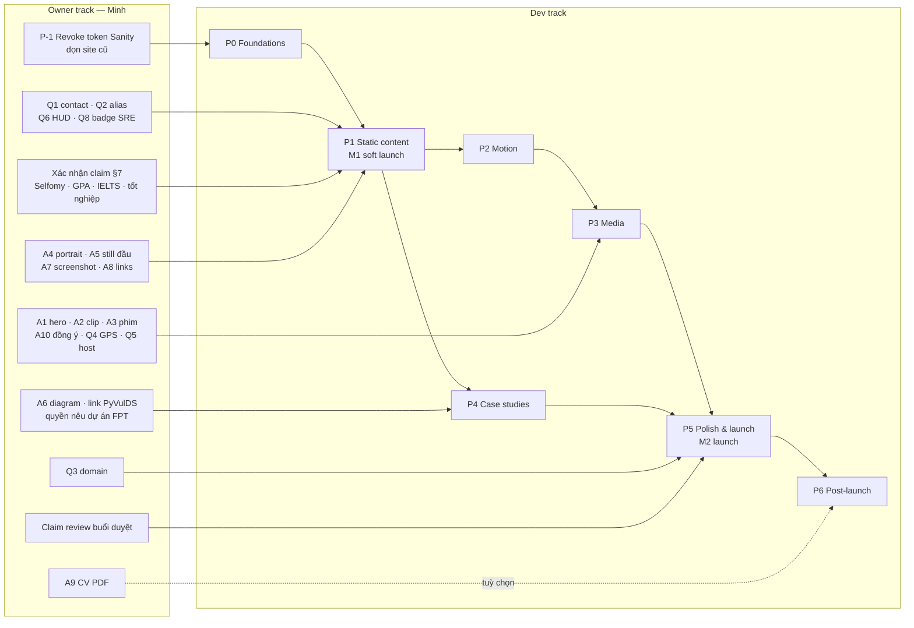
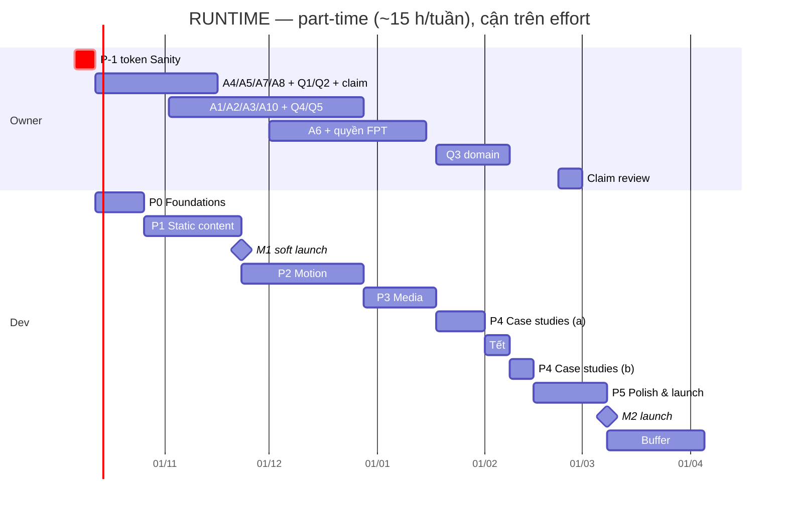

# RUNTIME — Lộ trình build (P-1 → P6)

> **File:** `03b-build-roadmap.md`
> **Tài liệu cha:** `00-master-plan.md` (source of truth). Tên kỹ thuật (đường dẫn, script, budget, CI gate) lấy theo `03a-tech-architecture.md`; nếu 03a đổi tên, 03a thắng.
> **Phạm vi:** kế hoạch build cho **một developer**, track nội dung song song của **Minh (owner)**, sơ đồ phụ thuộc, lịch tuần, cut list, risk register, Definition of Done. Không chứa code ứng dụng.

---

## 0. Tóm tắt một trang

| Phase | Tên | Kết quả cốt lõi | Effort (ngày công) | Ship được độc lập? |
|---|---|---|---|---|
| **P-1** | Khẩn cấp: token Sanity bị lộ | Token ghi bị revoke, repo cũ sạch secret, form ghi tắt | 0.5 (Minh) | — (không phụ thuộc redesign) |
| **P0** | Foundations | Repo, token, font, lưới, `SceneShell`, HUD tĩnh, schema + claim guard, CI, Vercel preview | 3–5 | Không (khung) |
| **P1** | Static content complete | 9 scene + mọi route ở trạng thái đọc được cuối cùng, không motion, responsive 375–1920, AA | 7–10 | **Có** — mốc soft launch |
| **P2** | Motion | Lenis (Tier A) + tier A/B/C, cold-open, SplitText, 2 pin, timecode, ⌘K, cursor, chuyển trang | 9–13 | Có |
| **P3** | Media | Pipeline encode, hero loop, dải field-notes + lightbox, `/films` | 5–8 | Có |
| **P4** | Case studies | `/work/pyvulds` đầy đủ, 3 case còn lại, `/archive` hoàn chỉnh | 6–9 | Có |
| **P5** | Polish & launch | Budget, LHCI, axe, visual regression, CSP, SEO/OG, claim review, domain, redirect | 5–8 | **Launch** |
| **P6** | Post-launch | Đọc analytics, thêm phim, `/cv` (nếu duyệt), Web Audio (tuỳ chọn) | liên tục | — |

**Tổng effort dev P0–P5:** 35–53 ngày công, chưa gồm buffer 20 %.
**Lịch:** part-time (~15 h/tuần): soft launch P1 khoảng **tuần 6 (22/11/2026)**, launch đầy đủ khoảng **tuần 20–23 (cuối 02 → giữa 03/2027)**. Full-time: launch khoảng **tuần 10–13 (giữa 12/2026 → đầu 01/2027)**. Chi tiết ở §5.

---

## 1. Giả định & nguyên tắc lập kế hoạch

### 1.1 Giả định

- **Một developer.** Có thể chính là Minh. Effort trong tài liệu **chỉ** tính việc dev. Việc của owner (quay, dựng, viết copy, xác nhận claim) nằm ở track riêng (§3); nếu một người làm cả hai, cộng thêm khoảng 1 ngày/tuần cho owner track.
- **1 ngày công = 6 giờ tập trung.** Part-time 15 h/tuần ≈ **2.5 ngày công/tuần**; full-time ≈ **5 ngày công/tuần**.
- Stack cố định theo master §9 và 03a: Next.js App Router + TypeScript + Tailwind v4 + shadcn/ui (Dialog, Command, Tooltip) + GSAP (ScrollTrigger, SplitText, Flip) + `@gsap/react` + Lenis (window scroll) + MDX + `@phosphor-icons/react`; font Fraunces / Geist / Geist Mono qua `next/font` (latin + vietnamese). Không Three.js, không CMS, dark-only, âm thanh tắt mặc định, không form ghi DB. Hosting Vercel.
- Effort là khoảng ước lượng cho người đã quen Next.js + GSAP; lần đầu dùng ScrollTrigger pin + Lenis thì cộng thêm 20–30 % vào P2.
- Không có số liệu nào trên site được tạo ra trong lúc build: mọi con số đi qua claim ledger (master §7) và schema `claimStatus`.

### 1.2 Nguyên tắc

1. **Mỗi phase kết thúc ở trạng thái deploy được** trên nhánh `main` (Vercel preview luôn xanh). Không có nhánh dài ngày.
2. **Nội dung trước, motion sau.** P1 phải ship được khi không có một dòng GSAP nào. Motion (P2) chỉ là lớp tăng cường; tier C luôn bằng đúng trạng thái P1.
3. **Gate tích luỹ.** Gate CI của phase trước không được gỡ ở phase sau (ví dụ: axe từ P1 vẫn chạy ở P2–P5).
4. **Exit criteria phải quan sát được:** có lệnh, URL, ảnh chụp hoặc số đo để người khác kiểm lại, không dựa vào cảm giác “trông ổn”.
5. **Asset trễ không chặn dev:** mỗi asset có phương án dự phòng (§3.1), miễn là phương án đó trung thực, không phải placeholder giả.

---

## 2. Các phase

### P-1 — Khẩn cấp: xử lý token Sanity bị lộ (làm trước mọi việc khác)

**Bối cảnh (audit):** repo công khai `Supporter09/Mai_Minh_Portfolio` commit file `.env` chứa `REACT_APP_SANITY_TOKEN` (token **ghi**), token này còn được bundle vào JS phía client của `nhat-minh-portfolio.vercel.app`. Hậu quả: bất kỳ ai cũng ghi/xoá được dataset `production` của project Sanity `6m187e00`. Site cũ còn công khai số điện thoại, trái với quy định của profile mới.

**Owner:** Minh (cần quyền admin Sanity + GitHub + Vercel). **Effort:** 0.5 ngày. **Phụ thuộc:** không có, không chờ redesign.

Các bước, theo thứ tự:

1. **Revoke token** trong Sanity Manage → project `6m187e00` → API → Tokens. Xoá luôn mọi token ghi khác không còn dùng.
2. **Sao lưu & kiểm tra dataset:** export dataset `production` (Sanity CLI `dataset export`) và lưu file kèm ngày. Rà document lạ hoặc bị xoá/sửa (đặc biệt `_type == "contact"` có thể chứa spam hoặc dữ liệu người lạ gửi). Nếu dataset không còn cần thiết thì xoá dataset/project sau khi export.
3. **Siết CORS origins** của project về đúng domain cũ (hoặc gỡ hết nếu bỏ project).
4. **Tắt form ghi** của site cũ: redeploy bản đã gỡ form `client.create(...)` và gỡ thẻ số điện thoại. Cách khác là chuyển luôn site cũ sang chế độ redirect sớm (xem P5) nếu Minh chấp nhận để trống vài tuần.
5. **Dọn repo cũ:** archive hoặc chuyển private. Nếu muốn giữ công khai thì xoá `.env` khỏi lịch sử (`git filter-repo`) và force-push. Lưu ý: fork/clone/cache bên ngoài vẫn còn bản cũ, nên **revoke (bước 1) mới là biện pháp thật**; dọn lịch sử chỉ là vệ sinh.
6. Kiểm tra tab Security → secret scanning alerts trên GitHub và đóng alert sau khi revoke.
7. Ghi một dòng incident note ngắn (ngày phát hiện, ngày revoke, có hay không dấu hiệu lạm dụng) vào sổ riêng của Minh. Không publish.

**Exit criteria (kiểm được):**

- [ ] Request dùng token cũ tới API Sanity của project (ví dụ một query có header `Authorization: Bearer <token cũ>`) trả **401**.
- [ ] `gitleaks detect` trên repo cũ (nếu còn công khai) báo 0 finding; hoặc repo đã archived/private.
- [ ] Trang cũ không còn form gửi dữ liệu và không còn số điện thoại (kiểm bằng view-source / DevTools Network khi bấm gửi: không có request tới `*.api.sanity.io` với method POST).
- [ ] Đã có file export dataset (hoặc xác nhận đã xoá project).

---

### P0 — Foundations

**Mục tiêu:** khung kỹ thuật đúng hợp đồng (scene id, token, tier, claim guard) để mọi phase sau chỉ thêm nội dung/hành vi, không phải sửa nền.
**Effort:** 3–5 ngày. **Cần từ owner:** không bắt buộc (dùng nội dung thật đã có trong profile).

**Deliverables:**

1. **Repo mới** (tên gợi ý `runtime-portfolio`), TypeScript `strict`, App Router, npm (theo 03a), `.nvmrc`, `.gitignore` có `.env*`, **gitleaks** chạy pre-commit và trong CI ngay từ commit đầu.
2. **Tailwind v4 + token:** toàn bộ token master §5 (màu §5.1, font §5.2, motion §5.3, layout §5.4) khai báo một nơi (CSS variables + `@theme`), đúng tên. `01-design-system.md` được chỉnh giá trị, không đổi tên.
3. **shadcn/ui init** chỉ với Dialog, Command, Tooltip. Không kéo thêm component khi chưa cần.
4. **Font qua `next/font`:** Fraunces (roman `['opsz','SOFT','WONK']` preload, italic `['opsz']` không preload — 03a §6.3), Geist, Geist Mono, subset `latin` + `vietnamese`, `display: swap`, có fallback metric (`adjustFontFallback`) để giảm CLS.
5. **Layout grid** 4/8/12 cột, gutter và frame 1440 theo §5.4; z-index scale đúng §5.4.
6. **`<SceneShell>`**: nhận `id` (một trong 9 id của master §4.2), `slate`, `grade`, render `<section id aria-labelledby>`; **`<Slate>`** tĩnh.
7. **HUD skeleton** tĩnh: monogram `NM`, telemetry giữa (≥1024), nút `⌘K` (chưa có palette, disabled có nhãn) + Menu; skip link “Skip to content”; landmark `header/main/footer`.
8. **Route skeleton:** `/`, `/work/[slug]` (4 slug), `/films`, `/archive`, `/cv` (flag tắt → 404), `not-found` (“Scene not found — take 404”).
9. **Content schema** (`lib/content/schema.ts`, zod), có `claimStatus: 'verified' | 'reported' | 'confirm-before-publish' | 'planned'` trên mọi claim/metric, và **claim guard** (`scripts/check-claims.ts` chạy ở `prebuild`), hành vi theo 03a:
   - `confirm-before-publish` → **ẩn** khi `VERCEL_ENV=production`. Item có `onUnconfirmed: 'fail'` (ví dụ Selfomy “present”) làm **build fail**. Preview hiển thị kèm watermark **UNCONFIRMED**.
   - `reported` → không được truyền vào `<OdometerMetric>` (chặn ở type + schema) và luôn hiện nhãn “reported”.
   - `planned` → bắt buộc render kèm `<StatusBadge status="pre-production">`.
   - Mọi metric trong MDX đi qua component có `claimId`; lint số trong MDX (03a) bắt phần trăm/số liệu viết tay.
10. **CI (GitHub Actions):** lint, typecheck (`tsc --noEmit`), build, Vitest (unit cho claim guard), gitleaks, `npm audit --omit=dev --audit-level=high`.
11. **Vercel:** project mới, preview deploy cho mỗi PR, production chưa gắn domain.
12. **Header bảo mật nền** (X-Content-Type-Options, Referrer-Policy, frame-ancestors) — CSP đầy đủ để P5.

**Exit criteria:**

- [ ] CI xanh trên `main`: lint, typecheck, build, Vitest, gitleaks, audit.
- [ ] Preview URL render 9 `SceneShell` theo đúng thứ tự id master §4.2; mở `/#pyvulds` nhảy đúng section; DOM có đúng **một** `<main>` và mỗi section có `aria-labelledby` trỏ tới heading tồn tại.
- [ ] Unit test claim guard: fixture `confirm-before-publish` + `VERCEL_ENV=production` → item không có trong HTML output; fixture `onUnconfirmed:'fail'` → `npm run build` exit code ≠ 0; fixture `reported` truyền vào `OdometerMetric` → lỗi typecheck.
- [ ] Trang test font (chỉ preview) render “Mai Văn Nhật Minh · ỗ ữ ặ ẫ ợ ự” bằng cả 3 font, và smoke test Playwright xác nhận `document.fonts.check()` đúng cho từng font. Metadata Fontsource/Google Fonts đã liệt kê `vietnamese` cho Geist, Geist Mono và Fraunces (R12 đã giảm thiểu); chỉ khi smoke test fail mới chuyển body sang Be Vietnam Pro (master §5.2) và báo lại cho 01/03a.
- [ ] Không có mã màu hex viết thẳng ngoài file token (script grep trong CI).
- [ ] `/cv` trả 404 khi flag tắt.

---

### P1 — Static content complete (không motion)

**Mục tiêu:** một site **ship được ngay**: đọc trọn câu chuyện, đúng claim, đạt AA, đẹp ở mọi viewport, không cần JS để đọc nội dung. Đây là lưới an toàn của cả dự án: nếu mọi thứ sau trễ, P1 vẫn đủ để gửi hồ sơ.
**Effort:** 7–10 ngày. **Cần từ owner (needed by P1):** A4, A7, A8, một phần A5; trả lời câu hỏi mở 1, 2 và 8 (badge SRE); xác nhận các claim “confirm before publish” mà Minh muốn hiện.

**Deliverables:**

1. **9 scene ở trạng thái cuối (end-state)** đúng copy trong 02a/02b, dữ liệu từ `content/`:
   - `cold-open`: ở P1 hành xử như tier C, tức **không render** overlay. Scene 01 hiển thị trực tiếp.
   - `opening`: tên (span tên có `lang="vi"`), headline định vị, 2 CTA đúng master §4.3; nền là **poster tĩnh** (still A5 hoặc frame từ A1), chưa có video.
   - `origin`: bio + portrait (A4, hoặc `profile.png` cũ xử lý lại màu nếu A4 trễ), sticky CSS ở desktop.
   - `log`: git-graph dạng `<ol>` tĩnh, commit mở rộng bằng `<button aria-expanded>`; số 70 % và 3 học bổng ở **giá trị cuối** (chưa đếm).
   - `pyvulds`: pipeline 6 bước dạng sơ đồ tĩnh, kết quả có câu phạm vi, **panel Limitations**; CTA tới case study.
   - `reel`: danh sách dọc 4 dự án + link Archive (pin ngang để P2).
   - `field-notes`: dải still tĩnh có frame code, địa điểm cấp thành phố (GPS chờ câu hỏi mở 4), CTA “See all films” chỉ hiện khi `/films` bật.
   - `credits`: HUST, 3 học bổng, giải thưởng, KAIST GPW, "IELTS Academic 7.5" (verified, không ngày thi/không ngụ ý còn hạn); GPA chỉ hiện nếu đã chuyển `verified`.
   - `next-scene`: research direction với `StatusBadge pre-production`, mục tiêu Fall 2027, contact CTA bằng kênh **đã duyệt** (mailto + LinkedIn), footer tách Engineering / Film links.
2. **Mọi route ở trạng thái đọc được, nội dung thật** (không lorem, không placeholder):
   - `/work/*`: bản gọn có Summary → Key evidence (kèm phạm vi) → Limitations → link. P4 mở rộng thành bản đầy đủ.
   - `/archive`: danh sách 2020–2022 (Vietcode, VYA, AnimalShelter, HRFO).
   - `/films`: **tắt bằng flag** (404, không có trong nav/sitemap) nếu chưa có A3; bật ở P3.
   - `/cv`: tắt (gated). `404`: hoàn chỉnh.
3. **Responsive** 375 → 1920, gồm landscape phone (≈ 667×375 và 844×390): không cuộn ngang, HUD không che nội dung, letterbox không làm tràn chữ.
4. **A11y AA:** landmark, thứ tự heading không nhảy cấp, focus ring amber, tap target ≥ 44 px, link icon có tên, `alt` có nghĩa, contrast theo token đã kiểm ở 01, `lang="en"` cho trang và `lang="vi"` cho tên.
5. **Metadata cơ bản:** title/description từng route, `robots` noindex trên preview.
6. **CI thêm:** Playwright + `@axe-core/playwright` trên mọi route; test no-JS (JS tắt vẫn đọc đủ nội dung); test bàn phím (Tab tới mọi CTA); linkinator cho link nội bộ.

**Exit criteria:**

- [ ] axe: **0 vi phạm serious/critical** trên mọi route đang bật, ở 390 và 1440.
- [ ] Lighthouse (mobile preset, median 3 lần) trên `/`: Performance, Accessibility, Best Practices, SEO đều ≥ 0.95.
- [ ] Ma trận ảnh chụp Playwright 375, 390, 768, 1024, 1440, 1920 + 667×375 + 844×390: `scrollWidth ≤ clientWidth` trên mọi route; ảnh chụp đã được Minh xem và duyệt (lưu làm **baseline P1**).
- [ ] Tắt JavaScript: toàn bộ copy 9 scene và `/work/*` đọc được, mọi link điều hướng hoạt động.
- [ ] Chỉ dùng bàn phím: đi hết trang chủ, mở từng commit trong `log`, tới contact CTA; focus luôn nhìn thấy.
- [ ] Build production (`VERCEL_ENV=production` trên preview env có cấu hình tương tự) **pass claim guard** với nội dung thật; không còn watermark UNCONFIRMED trong bản production.
- [ ] CLS < 0.05 (Lighthouse) trên `/`.
- [ ] Minh đọc toàn bộ copy và duyệt giọng văn (master §2.3).

> **Mốc M1 — Soft launch có thể xảy ra ở đây.** Tuỳ Minh: deploy production trên subdomain `*.vercel.app` mới (hoặc domain mới nếu đã có) để dùng cho hồ sơ, trong khi P2–P5 tiếp tục.

---

### P2 — Motion

**Mục tiêu:** thêm lớp điện ảnh theo 02a/02b mà **không** làm tier C khác P1 và không phá budget.
**Effort:** 9–13 ngày. **Cần từ owner:** không bắt buộc. Cần thiết bị thật: iPhone (Safari) + Android tầm trung.

**Thứ tự build bên trong P2** (mỗi bước merge riêng, sau mỗi bước tier C vẫn giữ nguyên P1):

1. `lib/motion/tiers.ts` — `useMotionTier(): 'A'|'B'|'C'` đọc `<html data-tier>` (inline boot script đặt trước first paint) + native `matchMedia`; **không** mặc định `'A'`, **không** import tĩnh `gsap` (master §5.3, §9.8). Boot script nằm trong danh sách hash CSP ở P5. Scene đang active ghi vào `<html data-active-scene>` (grain, grade, timecode dùng chung).
2. `lib/motion/lenis.ts` — Lenis trên window scroll, chạy qua `gsap.ticker`, refresh policy (fonts ready, poster load, resize), một instance duy nhất, **chỉ ở Tier A** (Tier B dùng scroll native).
3. GSAP tách thành **chunk lazy**, import động sau first paint, chỉ ở Tier A/B; Lenis nằm trong chunk đó nhưng chỉ khởi tạo ở Tier A (budget 03a: ≤ 75 KB gz).
4. Reveal theo scene trong `SceneShell` (opacity/transform, `--dur-*`, `--ease-*`).
5. `<TimecodeHUD>` (≥768): `SC xx · HH:MM:SS:FF` theo vị trí cuộn (đọc `window.scrollY`, cập nhật theo sự kiện scroll có rAF-throttle, không vòng lặp liên tục), ẩn khi `max-height: 500px`, click mở danh sách scene; chấm REC không nhấp nháy ở tier C.
6. `<CommandPalette>` (shadcn Command trong Dialog): nhảy scene, mở case study, copy email (qua claim `contact-primary`), bật/tắt motion (ghi đè tier → C, lưu `localStorage.runtime_motion='off'`, boot script 03a §4.3 đọc khoá này trước paint ở lần tải sau), nút mở cho touch.
7. `<OdometerMetric>` chỉ cho claim `verified` (70 %, 3).
8. **Pin #1 `pyvulds`** (rack focus 38→2, pipeline vẽ dần) chỉ khi `min-height: 720px`; **Pin #2 `reel`** cuộn ngang chỉ ≥1024 px tier A và `min-height: 600px`. Dưới ngưỡng chiều cao dùng layout không pin. Tối đa 2 pin/trang.
9. **Cold-open** ≤ 2.3 s (`boot-out 400ms … 1.9s`, 03a §4.3), skip bằng nút/Esc, `sessionStorage`, tier B rút gọn, tier C bypass, không chặn LCP.
10. SplitText cho headline < 8 chữ, có `aria-label` nguyên văn.
11. Custom viewfinder cursor (chỉ tier A, `pointer: fine`).
12. Chuyển trang `/` ↔ `/work/[slug]` (Flip/crossfade theo 02a §6); grain 8–12 fps; letterbox.

**Exit criteria:**

- [ ] **Tier C = P1:** Playwright với `reducedMotion: 'reduce'`, so ảnh với baseline P1 trên mọi route: không khác biệt ngoài ngưỡng visual regression cho phép (03a).
- [ ] **Không rò rỉ khi đổi route:** đi `/ → /work/pyvulds → /` 20 lần; `ScrollTrigger.getAll().length` quay về đúng giá trị baseline; chỉ có 1 instance Lenis/1 callback ticker; JS heap sau GC tăng ≤ 10 % (Chrome DevTools Memory).
- [ ] **Không jank:** DevTools Performance, CPU throttle 4×, cuộn qua 2 pin: không có long task > 50 ms trong lúc cuộn; trên Android tầm trung thật, pin không giật thấy được (quay màn hình 60 fps để lưu bằng chứng).
- [ ] Lighthouse mobile: Performance ≥ 0.95, TBT ≤ 150 ms; initial JS `/` ≤ 180 KB gz (bundle analyzer); CLS vẫn < 0.05.
- [ ] Cold-open: tự kết thúc ≤ 2.4 s; Esc bỏ qua trong ≤ 100 ms; reload cùng session không hiện lại; với reduced-motion không render.
- [ ] Command palette: mở bằng ⌘K/Ctrl K và bằng nút; điều khiển hoàn toàn bằng bàn phím; axe 0 vi phạm khi palette đang mở; Esc trả focus về nút mở.
- [ ] Toggle “motion off” trong palette chuyển ngay sang tier C và được ghi nhớ.
- [ ] iOS Safari thật: không khoá scroll, thanh địa chỉ co giãn không làm nhảy pin, landscape phone dùng được.

---

### P3 — Media

**Mục tiêu:** đưa footage thật vào mà vẫn giữ budget và quyền riêng tư.
**Effort:** 5–8 ngày. **Cần từ owner (needed by P3):** A1, A2, A3, A5 đầy đủ, A10; trả lời câu hỏi mở 4 (GPS) và 5 (nơi host phim).

**Deliverables:**

1. **Pipeline encode** `scripts/encode-video.sh` (ffmpeg): từ master 4K/1080p → AV1/WebM + H.264 MP4 (1080p, 720p), không audio track, **xoá toàn bộ metadata** (gồm GPS/thiết bị), poster AVIF/WebP; sinh manifest JSON (kích thước, thời lượng, bytes, hash) để content tham chiếu. Media đặt ở `public/media` (same-origin, cache immutable, CSP `'self'`). Chỉ chuyển sang Vercel Blob nếu tổng media > ~150 MB (theo 03a).
2. **`scripts/check-media.mjs`** trong CI: chặn file vượt budget size, chặn file còn tag GPS (exiftool).
3. **Hero loop (A1):** `autoplay muted playsinline loop`, poster là LCP element; tier B dùng 720p; tier C và `Save-Data` dùng poster + nút Play; tạm dừng khi ra khỏi viewport hoặc tab ẩn.
4. **Field-notes strip (A2/A5):** dải negative có frame code, timecode, địa điểm (GPS chỉ khi Q4 = có), tương tác “tap to develop”; **lightbox** bằng shadcn Dialog: focus trap, ←/→, Esc, caption + alt.
5. **`/films`:** grid + player facade **click-to-load YouTube-nocookie** (theo 03a; đổi nếu Q5 chọn host khác), phụ đề `.vtt` nếu phim có lời; bật flag `/films`, thêm vào nav và sitemap.
6. Tài liệu ngắn trong repo: “cách thêm một phim mới” (encode → manifest → PR). Dùng lại ở P6.

**Exit criteria:**

- [ ] `check-media.mjs` pass: mọi file trong budget 03a; `exiftool` không còn tag GPS/serial trên mọi output.
- [ ] Lighthouse mobile `/`: LCP ≤ 2.5 s (LHCI, simulated Slow 4G); LCP element là poster, không phải video.
- [ ] Tier C/reduced-motion: tab Network **không có** request video trước khi người dùng bấm Play.
- [ ] `/films` trước khi bấm: **0 request** tới domain YouTube/Google (facade đúng nghĩa).
- [ ] iPhone thật bật Low Power Mode: hero hiển thị poster + nút Play, không có ô đen/icon play lỗi của hệ điều hành.
- [ ] Lightbox: axe 0 vi phạm, Esc đóng, focus quay về thumbnail đã mở.
- [ ] Mỗi người có thể nhận diện trong footage công khai đều có dòng xác nhận đồng ý trong checklist A10.

---

### P4 — Case studies

**Mục tiêu:** chiều sâu bằng chứng: nơi recruiter/hội đồng tuyển sinh đọc kỹ nhất.
**Effort:** 6–9 ngày. **Cần từ owner (needed by P4):** A6, A7 (đã che thông tin nội bộ), link công khai PyVulDS (repo/report nếu có), xác nhận quyền nêu dự án nội bộ FPT ở mức outcome.

**Deliverables:**

1. **`/work/pyvulds`** (MDX) theo đúng pattern: **Problem → Constraints → System Design → Contribution → Evidence → Limitations → Next Step**.
   - System Design: diagram 6 bước (A6) vẽ lại thành SVG có `<title>/<desc>` + mô tả text tương đương.
   - Evidence: F1 0.900–0.972 (7 loại), 0/9 → 9/9, precision 0.105 → 1.000 (recall 1.000) trên VAmPI SQL, 38 → 2 trên PyGoat 2 file — **mỗi số kèm câu phạm vi**, đi qua `claimId`.
   - **Limitations panel bắt buộc** (schema: mảng `limitations` không rỗng, nếu không thì build fail). Có câu không tuyên bố vượt Semgrep.
   - Next Step: gắn `StatusBadge` phù hợp.
2. **`/work/sre-release-automation`**: chỉ outcome + công nghệ (70 % giảm bước thủ công, ArgoCD notifications, SonarQube tập trung, AI assistant nội bộ ở mức mô tả). Không kiến trúc nội bộ, quy trình, định danh, prompt. Diagram nếu có thì là sơ đồ trừu tượng.
3. **`/work/testeria`**: case ngắn (2nd IAI Hackathon 2023, WebSockets 50+ học sinh đồng thời, GitHub Actions), screenshot A7.
4. **`/work/hust-smart-assistant`**: case ngắn; “90 % query accuracy” chỉ hiện với nhãn **reported**, không odometer.
5. **`/archive`** hoàn chỉnh: Vietcode, VYA, AnimalShelter (award), HRFO — danh sách gọn, link còn sống (linkinator), không highlight.
6. Điều hướng giữa case (prev/next), breadcrumb, thời gian đọc.

**Exit criteria:**

- [ ] Schema validate: `/work/pyvulds` có đủ 7 section theo đúng thứ tự; thiếu một section → build fail (có unit test).
- [ ] Lint số trong MDX: 0 số liệu viết tay ngoài component có `claimId`.
- [ ] Minh ký duyệt từng case (checkbox trong PR), riêng `sre-release-automation` có ghi chú “đã đối chiếu quy định bảo mật nơi làm việc”.
- [ ] axe 0 serious/critical; mọi diagram có text tương đương; heading không nhảy cấp.
- [ ] linkinator: 0 link nội bộ hỏng; link ngoài trong `/archive` đã kiểm tay (link chết thì gỡ, không giữ).

---

### P5 — Polish & launch

**Mục tiêu:** khoá chất lượng bằng gate tự động, rồi chuyển domain.
**Effort:** 5–8 ngày. **Cần từ owner (needed by P5):** domain (Q3), repo public/private (Q7), buổi claim review, quyết định redirect site cũ, A5 cho OG.

**Deliverables:**

1. **Performance budget** (03a) thành assert trong Lighthouse CI: Perf/A11y/BP/SEO ≥ 0.95 (mobile preset, median 3), LCP ≤ 2.5 s (LHCI) và mục tiêu thực tế < 2.0 s trên 4G tầm trung, TBT ≤ 150 ms, CLS < 0.05, font ≤ 120 KB, initial JS ≤ 180 KB gz, chunk motion ≤ 75 KB gz.
2. **axe** trên mọi route × tier (A, B, C) trong Playwright.
3. **Visual regression** 390 / 768 / 1440 (Playwright `toHaveScreenshot`) với baseline đã duyệt.
4. **CSP** theo 03a: hash-based, build 2 lượt (`next build && node scripts/csp-hashes.mjs && next build && node scripts/csp-hashes.mjs --verify`); chạy `Content-Security-Policy-Report-Only` trên preview trước, sau đó enforce. `frame-src` chỉ cho host phim đã chọn. Kèm HSTS, Permissions-Policy, `frame-ancestors 'none'`.
5. **SEO/OG:** Metadata API cho từng route, canonical về domain mới, `sitemap.xml`, `robots.txt`, JSON-LD `Person` (không số điện thoại, không email cá nhân), OG image từ still A5 cho `/` và mỗi case.
6. **Claim review** với Minh: đi từng dòng master §7, đối chiếu với HTML production (không phải với MDX). Kết quả lưu thành checklist trong PR launch.
7. **Domain cutover:** gắn domain vào Vercel, HTTPS, `www` → apex (hoặc ngược lại) 308, verify Search Console, submit sitemap.
8. **Redirect site cũ:** project Vercel cũ chỉ còn cấu hình redirect 308 mọi path → domain mới. Hash cũ (`#about`, `#work`, `#skills`, `#contact`) không lên server; xử lý ở site mới bằng map alias phía client nhỏ (`#about → #origin`, `#work → #reel`, `#skills → #log`, `#contact → #next-scene`) hoặc chấp nhận về đầu trang.
9. **Analytics** cookieless theo 03a (không GA4, không PII); event cho CTA chính và phạm vi scene đã xem (P6 dùng).
10. Footer “Built with…” + build info (SHA, thời điểm build); `/changelog` là tuỳ chọn, mặc định tắt (master §4.1), chỉ link khi bật.

**Exit criteria:**

- [ ] LHCI xanh trên mọi route bật, mobile + desktop.
- [ ] Playwright: axe 0 serious/critical ở 3 tier; visual regression 0 diff ngoài ngưỡng; no-JS và keyboard path pass.
- [ ] CSP **enforce** (không còn report-only); console 0 vi phạm CSP khi đi hết mọi route ở 3 tier; `--verify` pass.
- [ ] `curl -I https://nhat-minh-portfolio.vercel.app/anything` → `308` với `location` về domain mới; `curl -I http://<domain>` → HTTPS.
- [ ] Search Console: domain mới đã verify, sitemap được đọc không lỗi.
- [ ] Rich Results Test / validator đọc được JSON-LD `Person`; OG preview đúng ảnh và tiêu đề (kiểm bằng trình debug chia sẻ của LinkedIn).
- [ ] Checklist claim review master §7 có chữ ký (comment duyệt) của Minh.
- [ ] Toàn bộ Definition of Done (§8) được tick.

---

### P6 — Post-launch

**Mục tiêu:** vận hành site như một hệ thống nhỏ: đo, sửa, cập nhật có kiểm soát.
**Effort:** ~0.5 ngày/tháng vận hành; các mục tuỳ chọn tính riêng.

| Việc | Khi nào | Effort | Điều kiện / Exit |
|---|---|---|---|
| Đọc analytics + Speed Insights (field p75 LCP < 2.0 s, INP < 150 ms) | +2 tuần, +6 tuần sau launch | 0.5 ngày/lần | Ghi 3 phát hiện + 1 hành động; chỉ sửa khi có dữ liệu |
| Thêm phim/clip | Khi Minh có footage mới | 0.5 ngày/phim | Đi qua pipeline P3; `check-media` pass; có A10 |
| `/cv` | **Chỉ khi** Minh duyệt A9 | 1–2 ngày | Print stylesheet sáng; không số điện thoại/email cá nhân/MSSV; bật flag |
| Web Audio synthesized (tuỳ chọn) | Sau khi budget còn dư | 2–3 ngày | Mặc định tắt; toggle trong palette; không tải file; tier C không phát |
| Làm mới claim | Mỗi khi có thay đổi: Selfomy, GPA, ngày tốt nghiệp, IELTS, PyVulDS publish | 0.25 ngày | PR đổi `claimStatus`; claim guard pass |
| External link check | Hằng tuần (CI schedule) | tự động | Link chết → issue |
| Cập nhật dependency | Hằng tháng | 0.5 ngày | `npm audit` high = 0; visual regression pass |

---

## 3. Track song song của owner (Minh)

### 3.1 Asset A1…A10 (master §8) — “needed by” và phương án dự phòng

| # | Asset | Needed by | Nếu trễ thì dev làm gì (vẫn trung thực) | Ghi chú privacy/claim |
|---|---|---|---|---|
| **P-1** | **Revoke token Sanity + dọn site cũ** | **Trước mọi việc** | — (không có dự phòng) | Bắt buộc, xem P-1 |
| A8 | Link công khai (GitHub, LinkedIn, email công việc, kênh video) | **P1** | Chỉ hiện link đã xác nhận; contact CTA không thể thiếu → **chặn exit P1** | Không email cá nhân, không số điện thoại |
| A4 | Portrait mới | **P1** | Xử lý lại `profile.png` cũ (grade amber, AVIF) | — |
| A5 | 8–15 still | **P1** (3–4 still đầu), đủ ở **P3** | Hero/field-notes dùng ít still hơn, dải ngắn hơn | Không mặt người cận nếu chưa có A10 |
| A7 | Screenshot Testeria, HUST Smart Assistant; SRE đã che | **P1** (bản gọn), đủ ở **P4** | Case gọn chỉ có text + sơ đồ trừu tượng | SRE: che định danh/kiến trúc nội bộ |
| A6 | Diagram + bảng số PyVulDS | **P1** (số liệu), **P4** (diagram) | P1 dùng sơ đồ text 6 bước | Số liệu kèm phạm vi |
| A1 | Hero loop 8–12 s | **P3** | Giữ poster tĩnh (đúng trạng thái P1) | Không mặt người cận, không âm thanh |
| A2 | 6–12 clip 5–8 s + metadata | **P3** | Field-notes chỉ still, không clip | GPS tuỳ Q4 |
| A3 | 2–4 phim đầy đủ (+ `.vtt`) | **P3** | `/films` tắt; scene 06 link ra kênh video (nếu có A8) | Host theo Q5 |
| A10 | Đồng ý của bạn bè; xác nhận được nhắc tên KAIST GPW | **P3** (footage), **P1** nếu P1 có nhắc KAIST bằng hình | Cắt người khỏi footage hoặc không dùng clip đó | Không có A10 thì không publish |
| A9 | CV PDF công khai | **P6** (tuỳ chọn) | `/cv` vẫn tắt | Đã lược thông tin riêng |

### 3.2 Xác nhận claim (master §7) — needed by

| Claim | Hành động của Minh | Needed by | Mặc định nếu chưa xác nhận |
|---|---|---|---|
| Selfomy 07/2024–nay còn làm? | Xác nhận hoặc cho end date | **P1**; **launch blocker** | `onUnconfirmed:'fail'` → build production fail, buộc phải trả lời |
| Selfomy “30 % giảm lỗi production” | Bằng chứng + phạm vi đo | P1 | Ghi “reported”, không odometer |
| GPA 3.82 vs 3.84 | Bảng điểm chính thức | P1 (nếu muốn hiện) | Ẩn |
| IELTS 7.5 — ngày thi | Không cần cho launch (claim `ielts-7-5` đã verified) | — | Hiện “IELTS Academic 7.5”, không ngày thi, không ngụ ý còn hạn |
| Tháng tốt nghiệp 2027 | Tháng chính thức | P1 | Chỉ ghi năm |
| Link công khai PyVulDS (repo/report/demo) | URL hoặc “không công khai” | P4 | Không có link; case vẫn đầy đủ |
| Quyền nêu dự án nội bộ FPT ở mức outcome | Xác nhận | P4 | Chỉ 70 % + công nghệ, không trang case riêng |
| Duyệt giọng văn tagline “I care about what's actually in focus.” | Duyệt/sửa | P1 | Dùng headline định vị, bỏ tagline |

### 3.3 Câu hỏi mở (master §10) — phase bị chặn

| # | Câu hỏi | Chặn phase | Mặc định an toàn nếu chưa trả lời |
|---|---|---|---|
| Q1 | Email công khai nào? LinkedIn URL? | **P1** (contact CTA, palette “copy email”); **launch blocker** | Không có mặc định an toàn → **blocker exit P1** và build production fail tới khi có kênh đã duyệt |
| Q2 | Giữ alias “Charlie”/“CatTheDev” hay chỉ tên thật? | P1 (copy, metadata, JSON-LD) | Chỉ tên thật |
| Q3 | Domain mới? | **P5** (cutover, canonical, OG URL); nên chốt trước P5 ≥ 1 tuần để DNS và Search Console kịp | Launch trên `*.vercel.app` mới, cutover sau |
| Q4 | Công khai GPS thật hay chỉ tên thành phố? | P3 (metadata field-notes) | Chỉ tên thành phố |
| Q5 | Phim đầy đủ host ở đâu? | P3 (`/films`), P5 (CSP `frame-src`) | YouTube unlisted + nocookie facade |
| Q6 | HUD ghi tên thành phố hay chỉ `VIETNAM`? | P0 (HUD skeleton telemetry) | `VIETNAM · 21:04 ICT · ● REC`; chuỗi thành phố chỉ là owner-approved option |
| Q7 | Repo site mới public hay private? | P5 (footer build info: SHA có link tới commit hay không) | SHA hiển thị dạng text, không link |
| Q8 | Card SRE release automation có gắn badge **RELEASED** không? | P1 (card SRE trong `reel`) | Không gắn badge; chỉ outcome như trong profile |

**Launch blocker (master §10):** (1) kênh liên hệ công khai đã duyệt (Q1); (2) Minh xác nhận Selfomy “present” (§3.2). Thiếu một trong hai → build production fail có chủ đích, không launch M2.

---

## 4. Sơ đồ phụ thuộc

Ghi chú về phụ thuộc:

- `T → P0` là phụ thuộc **quy trình**, không phải kỹ thuật: không mở repo mới khi secret cũ còn hiệu lực.
- **P4 chỉ phụ thuộc P1**, không phụ thuộc P2/P3. Một dev nên làm tuần tự, nhưng **thứ tự P2/P3/P4 có thể đổi** (xem §5.3).
- P3 phụ thuộc P2 vì hero/lightbox dùng tier và refresh policy của P2. Nếu cắt P2 (§6), P3 chạy với hành vi tier C/B tối giản.

---

## 5. Lịch theo tuần

### 5.1 Giả định lịch

- Tuần 1 bắt đầu **thứ Hai 12/10/2026**; tuần 0 (06–11/10) dành cho P-1.
- Part-time = 2.5 ngày công/tuần; full-time = 5 ngày công/tuần (6 h tập trung/ngày).
- Lấy cận **trên** của effort cho từng phase, rồi thêm buffer chung ở cuối (≈ 20 %).
- Part-time trừ **1 tuần Tết Nguyên đán 2027** (khoảng đầu tháng 02/2027) và giả định tuần thi cuối kỳ HUST nằm trong buffer. Minh nên chỉnh lại theo lịch học thật.
- Owner track chạy song song và **không** chiếm thời gian dev; nếu Minh tự build, cộng ~1 ngày/tuần (lịch part-time sẽ dài thêm khoảng 30–40 %).
- Bối cảnh: mục tiêu thạc sĩ Fall 2027, nên **M1 (P1 ship được) nên có trước mùa nộp hồ sơ**. Lịch dưới ưu tiên điều đó.

### 5.2 Bảng lịch

| Phase | Effort (ngày) | Part-time: tuần | Part-time: ngày | Full-time: tuần | Full-time: ngày |
|---|---|---|---|---|---|
| P-1 | 0.5 (Minh) | W0 | 06–11/10/2026 | W0 | 06–11/10/2026 |
| P0 | 3–5 | W1–W2 | 12/10–25/10 | W1 | 12/10–18/10 |
| P1 | 7–10 | W3–W6 | 26/10–22/11 | W2–W3 | 19/10–01/11 |
| **M1 soft launch** | — | **cuối W6** | **≈ 22/11/2026** | **cuối W3** | **≈ 01/11/2026** |
| P2 | 9–13 | W7–W11 | 23/11–27/12 | W4–W6 | 02/11–22/11 |
| P3 | 5–8 | W12–W14 | 28/12–17/01/2027 | W7–W8 (nửa) | 23/11–03/12 |
| P4 | 6–9 | W15–W16, W18 (W17 nghỉ Tết) | 18/01–31/01 + 08/02–14/02 | W8 (nửa)–W10 (đầu) | 04/12–15/12 |
| P5 | 5–8 | W19–W21 | 15/02–07/03 | W10–W11 | 16/12–27/12 |
| **M2 launch (không buffer)** | — | **cuối W21** | **≈ 07/03/2027** | **cuối W11** | **≈ 27/12/2026** |
| Buffer ~20 % | — | W22–W25 | 08/03–04/04 | W12–W13 | 28/12–10/01/2027 |
| **M2 launch (có buffer)** | — | **≤ W25** | **≤ 04/04/2027** | **≤ W13** | **≤ 10/01/2027** |

Nếu làm theo cận **dưới** của effort: part-time launch khoảng W15–W16 (cuối 01/2027), full-time khoảng W8 (đầu 12/2026).

### 5.3 Phương án sắp xếp lại (cho owner, không phải quyết định)

- **Ưu tiên hồ sơ:** đưa **P4 (ít nhất `/work/pyvulds`) lên ngay sau P1**, trước P2. Part-time: case PyVulDS đầy đủ có khoảng W9 (≈ 13/12/2026) thay vì W18. Đánh đổi: motion về muộn hơn ~3 tuần.
- **Cutover domain sớm:** gắn domain mới ở M1 (nếu Q3 đã chốt), P5 chỉ còn gate chất lượng + redirect. Đánh đổi: phải chạy CSP/SEO tối thiểu sớm hơn (~0.5 ngày).

---

## 6. Cut list — **phương án cho Minh, không phải quyết định**

> Chỉ dùng khi thiếu thời gian. Sắp xếp theo thứ tự **nên cân nhắc cắt trước** (mất ít giá trị nhất so với công tiết kiệm được). Mỗi mục đều có trạng thái còn lại vẫn hoàn chỉnh, không để lại tính năng dở dang. Minh chọn; dev không tự cắt.

| Thứ tự | Phương án cắt | Tiết kiệm (ngày) | Còn lại sau khi cắt | Mất gì |
|---|---|---|---|---|
| 1 | **Web Audio** (P6) | 2–3 | Site im lặng (vốn là mặc định) | Gần như không mất gì |
| 2 | **Custom viewfinder cursor** | 1–1.5 | Cursor hệ thống; viewfinder brackets vẫn có ở focus ring/khung media | Một chi tiết tier A |
| 3 | **Chuyển trang Flip** `/` ↔ `/work` | 1–2 | Crossfade ≤ 200 ms hoặc điều hướng thường | Cảm giác “cắt dựng” giữa trang |
| 4 | **Grain động (canvas 8–12 fps)** | 0.5–1 | Grain SVG tĩnh | Độ “sống” của phim, rất nhỏ |
| 5 | **Odometer animation** | 0.5 | Số hiển thị tĩnh giá trị cuối | Nhấn nhá số liệu |
| 6 | **“Tap to develop”** ở field-notes | 1 | Dải negative tĩnh + lightbox | Một tương tác đặc trưng |
| 7 | **Trang `/films`** | 1.5–2 | Scene 06 link ra kênh video (A8) | Trải nghiệm xem trên site |
| 8 | **Pin #2 `reel` cuộn ngang** | 1.5–2 | Danh sách dọc như P1 + reveal | Khoảnh khắc “show-off” desktop thứ hai |
| 9 | **Cold-open** | 1.5–2 | Vào thẳng scene 01 (như tier C) | Nghi thức mở màn; đổi lại LCP/UX đơn giản hơn |
| 10 | **Case `testeria` + `hust-smart-assistant` thành trang riêng** | 1.5–2 | Hai card mở rộng trong `reel` + `/archive` | Chiều sâu 2 dự án phụ |
| 11 | **Hero video (A1)** | 1–1.5 | Poster still tĩnh (đã có từ P1) | Ấn tượng thị giác đầu tiên — chỉ cắt khi A1 không kịp |

### Không bao giờ cắt

- **P-1** — revoke token Sanity và dọn site cũ.
- **A11y WCAG 2.2 AA:** axe 0 serious/critical, bàn phím, focus, landmark, contrast, alt/text tương đương cho diagram.
- **Reduced-motion (tier C) đầy đủ** và toggle motion: mọi scene có trạng thái cuối, không autoplay video.
- **Độ chính xác claim:** claim guard, nhãn `reported`, `StatusBadge` trung thực, buổi claim review §7.
- **Performance budget** (03a) và LHCI gate.
- **Panel Limitations của PyVulDS** (ở scene 04 và `/work/pyvulds`).
- **Privacy:** đồng ý A10, xoá metadata/GPS khỏi media, không số điện thoại/email cá nhân/MSSV, không thông tin nội bộ FPT.
- **Bảo mật nền:** không secret phía client, gitleaks trong CI, header bảo mật + CSP.
- **Nội dung đọc được khi tắt JS** (bảo đảm bởi P1).

---

## 7. Risk register

Thang: Khả năng / Tác động = Thấp · TB · Cao. Owner: **Dev** hoặc **Minh**.

| # | Rủi ro | Khả năng | Tác động | Giảm thiểu | Owner |
|---|---|---|---|---|---|
| R1 | **Token Sanity cũ bị lạm dụng** (ghi/xoá dataset, đăng nội dung bẩn dưới tên Minh trên site cũ) trước khi revoke | TB | Cao | P-1 ngay tuần 0; export dataset làm bằng chứng/khôi phục; tắt form; site cũ chuyển redirect ở P5 | Minh |
| R2 | **iOS Safari chặn autoplay / Low Power Mode** → hero thành ô đen hoặc icon play hệ thống | Cao | TB | `muted playsinline`; poster luôn là LCP; bắt lỗi `play()` → hiện nút Play riêng; test máy thật bật Low Power Mode (exit P3) | Dev |
| R3 | **Pin giật trên Android tầm thấp** | TB | TB | Pin ngang chỉ tier A ≥1024; tier B không pin ngang; chỉ animate `transform/opacity`; `will-change` bật/tắt theo vùng; đo CPU 4× + máy thật (exit P2); cut list #8 | Dev |
| R4 | **Dấu tiếng Việt: FOUT/clipping** (dấu chồng bị cắt bởi `line-height`/`overflow:hidden` trong SplitText, mask, letterbox; font fallback lệch metric) | Cao | TB | Subset `vietnamese` + `adjustFontFallback`; test string “Mai Văn Nhật Minh · ỗ ữ ặ ẫ” trong visual regression; SplitText mask có padding trên/dưới; nếu Geist thiếu subset → Be Vietnam Pro (exit P0) | Dev |
| R5 | **Asset trễ** (A1–A3, A10 phụ thuộc lịch quay/dựng và người khác) | Cao | TB | P1 không cần video; bảng dự phòng §3.1; hạn “needed by” rõ; P3 có thể đổi chỗ với P4 | Minh |
| R6 | **Sai claim** (số liệu vượt phạm vi, Selfomy hết hạn, GPA sai, ngụ ý vượt Semgrep) | TB | Cao | Schema `claimStatus` + guard + lint số MDX; mọi số qua `claimId`; claim review §7 trên HTML production; quy trình làm mới claim ở P6 | Minh + Dev |
| R7 | **Rò rỉ GSAP/Lenis khi đổi route** trong App Router (ScrollTrigger trùng, ticker chồng, pin sai vị trí sau back/forward) | Cao | TB | `useGSAP` với scope + revert khi unmount; Lenis singleton; `ScrollTrigger.refresh()` theo policy 02a; test 20 vòng điều hướng (exit P2) | Dev |
| R8 | **Chi phí băng thông video** (vượt hạn mức Vercel khi có lượt chia sẻ lớn) | TB | TB | Budget size trong `check-media`; 720p cho tier B; không tải video ở tier C/Save-Data; phim dài để YouTube/Vimeo; theo dõi usage Vercel; chuyển Blob/CDN khác nếu > ~150 MB | Dev |
| R9 | **Privacy của bạn bè trong footage** (mặt, biển số, địa điểm nhà) | TB | Cao | A10 bắt buộc trước publish; không mặt cận ở hero; GPS mặc định tắt (Q4); xoá metadata (exiftool trong CI); gỡ clip ngay khi có yêu cầu | Minh |
| R10 | **Scope creep** (thêm WebGL, blog, CMS, form, hiệu ứng mới giữa chừng) | Cao | TB | Bám master §9; mọi ý mới vào backlog P6; cut list có sẵn; mỗi phase có exit criteria cố định | Minh + Dev |
| R11 | **Mất SEO khi đổi domain** (link cũ 404, Google giữ domain cũ) | Thấp | Thấp–TB | Redirect 308 toàn bộ path từ project cũ; canonical + sitemap domain mới; verify Search Console; alias hash cũ; giữ project cũ ≥ 12 tháng | Dev |
| R12 | **Thiếu subset vietnamese cho Geist/Geist Mono/Fraunces qua `next/font`** — **đã giảm thiểu**: metadata Fontsource/Google Fonts liệt kê `vietnamese` cho Geist, Geist Mono và Fraunces | Thấp | TB | Giữ smoke test P0 `document.fonts.check()` cho cả 3 font; chỉ khi fail mới dùng dự phòng Be Vietnam Pro (master §5.2) và báo 01/03a | Dev |
| R13 | **CSP vỡ do script inline của Next** (flight scripts không có hash/nonce dưới SSG; script `data-tier`) | TB | TB | Build 2 lượt + `--verify` theo 03a; report-only trên preview trước khi enforce | Dev |
| R14 | **Lịch học/thi và mùa nộp hồ sơ** chiếm thời gian của một người làm cả dev lẫn owner | Cao | TB | M1 trước mùa nộp hồ sơ; phương án đưa `/work/pyvulds` lên sớm (§5.3); buffer 20 % | Minh |
| R15 | **Lộ thông tin nội bộ FPT** qua screenshot/diagram SRE | Thấp | Cao | Chỉ outcome + công nghệ; diagram trừu tượng; Minh đối chiếu quy định nơi làm việc trước P4 exit | Minh |

---

## 8. Definition of Done — Launch (M2)

Launch chỉ khi **mọi** ô dưới đây được tick, mỗi ô có bằng chứng (link CI run, ảnh chụp, hoặc comment duyệt trong PR launch).

### 8.0 Launch blocker (master §10)

- [ ] Kênh liên hệ công khai đã được Minh duyệt (Q1, claim ledger `contact-primary` chuyển khỏi `confirm-before-publish` / `fail`) và là kênh duy nhất trong contact CTA Scene 08, palette “copy email”, footer, JSON-LD (đều qua `assertPublishable`).
- [ ] Selfomy “present” đã được Minh xác nhận (hoặc thay bằng end date); claim guard `onUnconfirmed:'fail'` pass ở build production.

### 8.1 Bảo mật & quyền riêng tư

- [ ] P-1 hoàn tất: token cũ trả 401; repo cũ archived/private hoặc sạch lịch sử; form cũ đã tắt.
- [ ] gitleaks 0 finding trên repo mới; không biến môi trường nào có prefix `NEXT_PUBLIC_` chứa secret.
- [ ] CSP enforce, `--verify` pass; HSTS, Referrer-Policy, Permissions-Policy, X-Content-Type-Options, `frame-ancestors 'none'`.
- [ ] `npm audit --omit=dev --audit-level=high` = 0.
- [ ] Không số điện thoại, email cá nhân, MSSV, bảng điểm trong HTML/JSON-LD/OG/sitemap (grep trên build output).
- [ ] Mọi media: không có tag GPS/serial (exiftool); A10 có đủ xác nhận cho người xuất hiện.

### 8.2 Nội dung & claim

- [ ] Claim review master §7 hoàn tất trên HTML production, Minh duyệt.
- [ ] Claim guard pass ở production; 0 watermark UNCONFIRMED; 0 số liệu ngoài `claimId`.
- [ ] Odometer chỉ cho claim `verified`; mọi claim `reported` có nhãn; research direction có badge PRE-PRODUCTION.
- [ ] `/work/pyvulds` đủ 7 section, có Limitations, không ngụ ý vượt Semgrep.
- [ ] `sre-release-automation` chỉ outcome + công nghệ, Minh đã đối chiếu quy định nơi làm việc.
- [ ] Không chữ “Expert”/“Researcher” làm danh xưng; dùng “Security Research Builder”.
- [ ] Contact chỉ dùng kênh Minh đã duyệt (Q1); không form ghi DB.

### 8.3 Trải nghiệm & a11y

- [ ] 9 scene đúng id/thứ tự master §4.2; mỗi màn hình đúng một primary CTA (master §4.3).
- [ ] axe 0 serious/critical trên mọi route × tier A/B/C; keyboard path pass; skip link + “Skip intro” hoạt động.
- [ ] Tier C: không Lenis, không pin/scrub/parallax, không autoplay; visual regression khớp baseline P1.
- [ ] Toggle motion trong palette hoạt động và được ghi nhớ.
- [ ] Responsive 375–1920 + landscape phone: không cuộn ngang; đã kiểm trên iPhone (Safari) và Android thật.
- [ ] Tắt JS vẫn đọc đủ nội dung mọi route.
- [ ] Tên “Mai Văn Nhật Minh” hiển thị đúng dấu ở cả 3 font, không bị cắt dấu ở mọi breakpoint.

### 8.4 Hiệu năng

- [ ] LHCI xanh mọi route (mobile + desktop): Perf/A11y/BP/SEO ≥ 0.95, LCP ≤ 2.5 s (lab), TBT ≤ 150 ms, CLS < 0.05.
- [ ] Initial JS `/` ≤ 180 KB gz; chunk motion ≤ 75 KB gz; font ≤ 120 KB.
- [ ] Media trong budget `check-media`; `/films` 0 request bên thứ ba trước khi bấm.
- [ ] Không rò rỉ khi đổi route (test 20 vòng pass).

### 8.5 SEO, domain & vận hành

- [ ] Domain mới HTTPS; `www`/apex chuẩn hoá bằng 308.
- [ ] Site cũ redirect 308 mọi path về domain mới (kiểm bằng `curl -I`).
- [ ] Canonical, sitemap, robots, JSON-LD `Person`, OG image cho `/` và mỗi case; Search Console verify + sitemap đọc OK.
- [ ] Analytics cookieless + Speed Insights đang nhận dữ liệu; không GA4 cũ.
- [ ] CI trên `main` xanh toàn bộ gate (lint, typecheck, Vitest, build 2 lượt CSP, Playwright: axe/no-JS/reduced-motion/keyboard/visual, LHCI, linkinator, check-media, audit, gitleaks).
- [ ] 404 “Scene not found — take 404” có link về `/`.
- [ ] Footer “Built with…” + build info (SHA, thời điểm build); nếu bật `/changelog` (tuỳ chọn, mặc định tắt) thì có mục cho bản launch.
- [ ] Có hướng dẫn trong repo: thêm phim mới, đổi `claimStatus`, bật `/cv`.

---

## Ghi chú cho orchestrator

1. **P1 “mọi route ở trạng thái đọc được” và P4 “case studies”:** tôi hiểu P1 = mọi route render nội dung thật ở mức **gọn** (Summary → Key evidence → Limitations) để P1 ship được độc lập; P4 mở rộng `/work/*` thành bản đầy đủ theo pattern 7 bước. `/films` ở P1 tắt bằng flag (404, ngoài sitemap) đến P3, vì không có phim thì không thể “đọc được” mà không dùng placeholder. Master không nêu chi tiết này nên không mâu thuẫn, chỉ là cách diễn giải.
2. **Tên kỹ thuật đã thống nhất với TechArchitecture (03a):** `lib/content/schema.ts` (zod), `scripts/check-claims.ts` (prebuild), `scripts/encode-video.sh`, `scripts/check-media.mjs`, `scripts/csp-hashes.mjs` (build 2 lượt), media ở `public/media`, phim đầy đủ qua YouTube-nocookie facade, budget (LCP ≤ 2.5 s lab / < 2.0 s field, TBT ≤ 150 ms, INP < 150 ms field, JS ≤ 180 KB gz, motion chunk ≤ 75 KB gz, font ≤ 120 KB). Hành vi guard: `confirm-before-publish` mặc định **ẩn** ở production; `onUnconfirmed:'fail'` thì build fail. 03b dùng npm theo 03a.
3. Đã xử lý: R12 hạ xuống “đã giảm thiểu” (metadata Fontsource/Google liệt kê `vietnamese` cho Geist, Geist Mono, Fraunces); giữ smoke test `document.fonts.check()` ở P0.
4. **Lịch so với mục tiêu Fall 2027:** part-time launch đầy đủ rơi vào khoảng 03–04/2027, có thể sau một số hạn nộp hồ sơ. Vì vậy 03b đặt mốc **M1 soft launch sau P1 (≈ 22/11/2026)** và đưa ra phương án đưa `/work/pyvulds` lên trước P2 (§5.3). Đây là phương án cho Minh, không phải quyết định.
5. **Số điện thoại trên site cũ:** đưa vào P-1 (gỡ cùng lúc với tắt form), vì profile quy định không công bố số điện thoại và site cũ vẫn đang chạy cho tới khi cutover.
